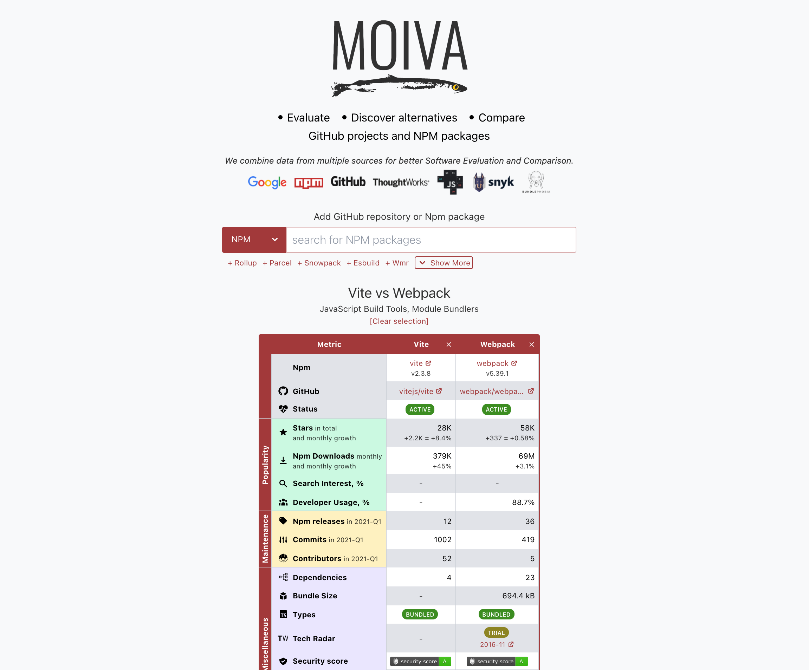

# [Moiva.io](https://moiva.io/)

A universal tool to Evaluate, Discover alternatives and Compare Software projects.

Currently supports Github and NPM. More to come.



## Goals

Moiva's ambitious 😎 goals:

- become the best tool to <ins>_Evaluate_</ins> software
- become the best tool to <ins>_Discover alternatives_</ins>
- become the best tool to <ins>_Compare_</ins> software

## The Library concept

The Library concept is central to Moiva's architecture.

It allows Moiva to be a _Universal_ and _Agile_, and defines how libraries are differentiated and categorized, how they should be referenced. 

Moiva currently supports Github repositories and NPM packages.

It's relatively easy to add support, for example, for [Maven](https://mvnrepository.com/) (Java projects), [Packagist](https://packagist.org/) (PHP) and [PIP](https://pypi.org/) (Python).

The Library concept can be simplistically described as a combination of two interfaces:

```ts
interface LibraryNpm {
  npm: string;
  isNpmCoreArtifact: boolean;
  repoId: string;
  category: string;
  alias: string;
}
interface LibraryGithub {
  repoId: string;
  category: string;
  alias: string;
}

type Library = LibraryNpm | LibraryGithub;
```

### Characteristics

The Library concept has the following important properties:

- a library should have a reference to a GitHub repository with the source code for the library.
- a library may have a reference to an Npm package.
- multiple libraries can reference to the same GihHub repository (think of a monorepo with multiple npm packages as artifacts)
- multiple libraries can NOT reference to the same Npm package. Only one library per Npm package is allowed.
- a library with a reference to an Npm package should have a boolean `isNpmCoreArtifact` flag denoting if the npm package is the main artifact of the GitHub repository, or it's just one of its by-products.
- multiple libraries referencing to the same GitHub repository can not have the `isNpmCoreArtifact` flag set to `true` at same time. The idea is that a GitHub repository can have only one library as its main artifact, but multiple libraries as its "by-products".
- a library referencing to a GitHub repository with an Npm package as its main artifact should have a reference to that package defined and `isNpmCoreArtifact` flag set to true.
- a library should have a `category` defined. A library can belong to only one category.
- a library may have an `alias` defined which is used to show up in suggestions and also serves for SEO purposes - shows up in Google Search results.

### Examples

Below are examples illustrating the relationship between Repostory, Npm package and Moiva Library.

1. A Repository doesn't have any related Npm package
   

2. A Repository has Npm packages as artifacts, but no package as a core artifact.
   

3. A Repository has Npm packages. One of the packages is the Repostory's core artifact.
   

4. A Repository can't have multiple core artifacts.
   

### Identification

The combination of `repo` and `npm` properties uniquely identifies a library.

### URL Reference

Every Library at [Moiva.io](https://moiva.io/) is uniquely referenced via URL.

Libraries with the `npm` property defined should be referenced by the name of their Npm package in the `npm` query parameter, for example, `?npm=vue`

Libraries without the `npm` property should be referenced using the repository's owner and name in the `github` query parameter, for example, `?github=facebook/react`

### Aliases

A Library can have an optional `alias` property defined.

Aliases are used to better represent the Library name in the Suggestions list and also in the page's Title and Description.

If `alias` is not defined, then the repository's name is used.

Repositories' names and aliases should be unique. If there are two repositories with the same name, at least one of them should have an `alias` defined.

## Contribution

1. If you want a specific library (a GitHub repo or an Npm package) to appear in the suggestion list and also appear in Google Search results, it should be added to [Moiva Catalog](https://github.com/aantipov/moiva-catalog).
   Feel free to open a PR or issue there.

2. If you noticed an issue at Moiva.io or have a suggestion/idea how to make it better, please open an issue in this repository.
