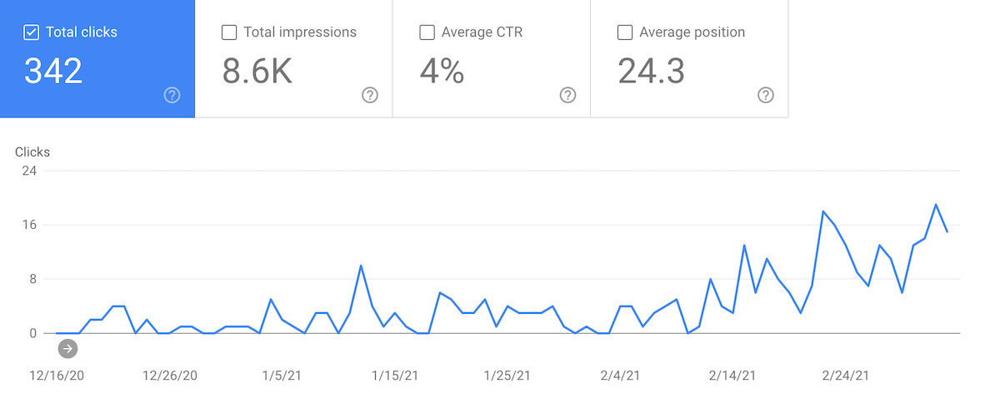

Hey folks, Alexey is here.

Here is what I've been busy with lately.

## Migration to Cloudflare Workers

[Vercel](https://vercel.com/) and its serverless functions allowed to quickly bootstrap and develop Moiva. And I'm thankful to the developers at Vercel for that, they do really great job!

Having said that, the more mature Moiva becomes, the more requirements it has and the more limitations of Vercel's platform it hits.

One of the limitations was Moiva's requirements to serverless functions. It needed more visibility, more efficiency, more sophisticated debugging capabilities, more advanced features.

One time I came across [Cloudflare Workers](https://workers.cloudflare.com/) and it caught my attention, it looked pretty attractive and seemed a mature and sophisticated solution for serverless functions.

After a bit of analysis, I quickly realized that it's the thing I needed.

So I set out to migrate all the api endpoints to Cloudflare Workers. I also implemented more sophisticated cache management tailored to each api endpoint. It took several evenings and mornings to finish it.

I believe such changes should improve Moiva's efficiency and it will become more noticeable once more users start using it and the Cache starts working to the full.

## Google Trends Chart fix

When I was doing the major refactoring of Moiva in January-February, I accidentally changed the way Google Trends Chart works - it lost optimization tricks I implemented before. That led to more requests being issued to get data for the chart. As a result, Google blocked Moiva completely and the chart stopped working, most probably it was blocked by the IP address.

I think Google Chart is one of the major metrics in evaluating popularity and I couldn't afford losing such a metric so easily.

My first idea was that the planned migration to Cloudflare workers + requests optimization + more advanced caching should fix the problem. But I soon realized that the [npm package](https://github.com/pat310/google-trends-api) that I use to communicate with Google Trends can't be used with Cloudflare Workers. Simply because Cloudflare Workers don't run NodeJS runtime environment which is required for the package to work.

That means that I still had to rely on Vercel's serverless functions which run from the same IP-addresses. After looking into Vercel's documentation for serverless functions I learned that all Vercel's functions are executed in the same single region, meaning they probably have the same IP-address. I also learned that recently Vercel changed the default region for serverless functions and now allows existing free developer accounts to do a one-time change of the region. That was exactly what I needed because with the region change comes the change of the IP-addresses.

I hope the current implementation and cache settings won't make any trouble to Google and Moiva will continue to provide the valuable data.

## Most popular tweet so far

While working on Moiva I noticed that [Preact](https://preactjs.com/) has a sharp increase in Npm downloads. I made a tweet about it wondering about the reason for that.

<Tweet id="_aantipov/status/1367183314256281603" />

The tweet turned to be quite popular with 20k impressions. It was my most popular tweet so far and it even beat all my monthly tweet impressions.

## Google Search results do better

In Google Search results Moiva didn't perform well for a while and it concerned me. I did many improvements but nothing really was changing and Google didn't want to digest my sitemap.
Fortunately, the results of the last month bring some hope.

## Last but not least

Moiva was featured in the [Makerwork](https://makerwork.substack.com/p/makerwork006) newsletter.
