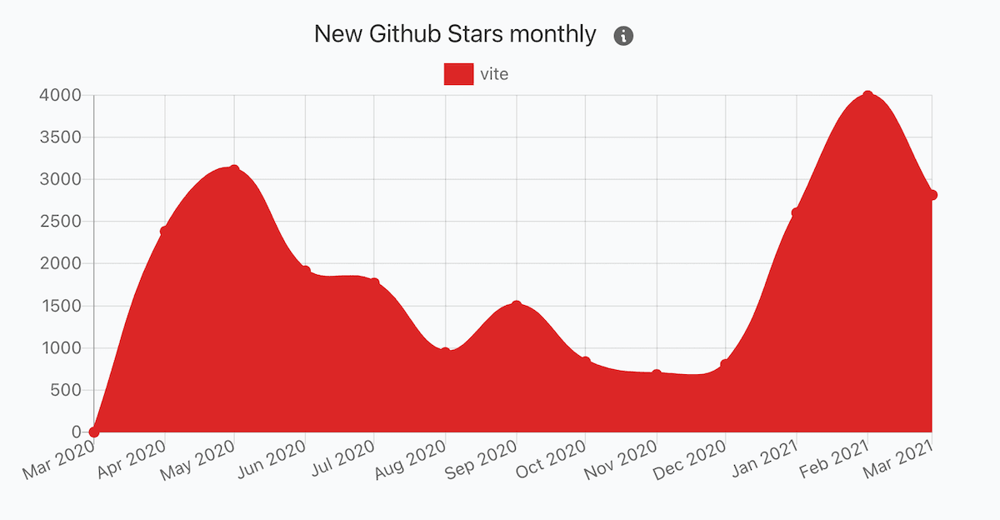
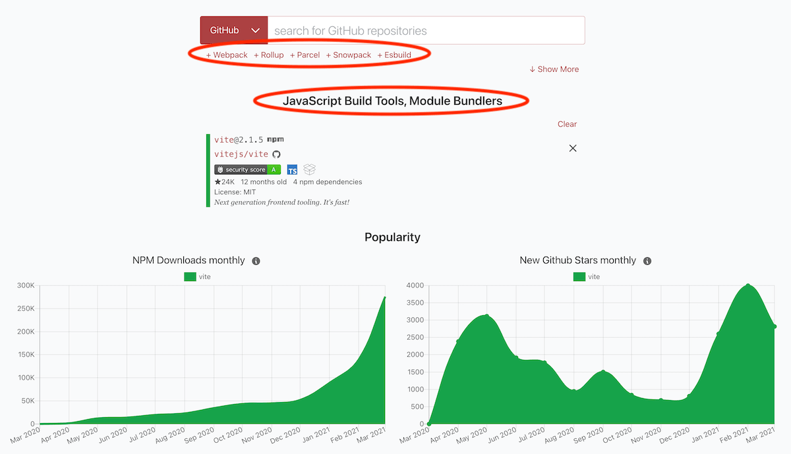
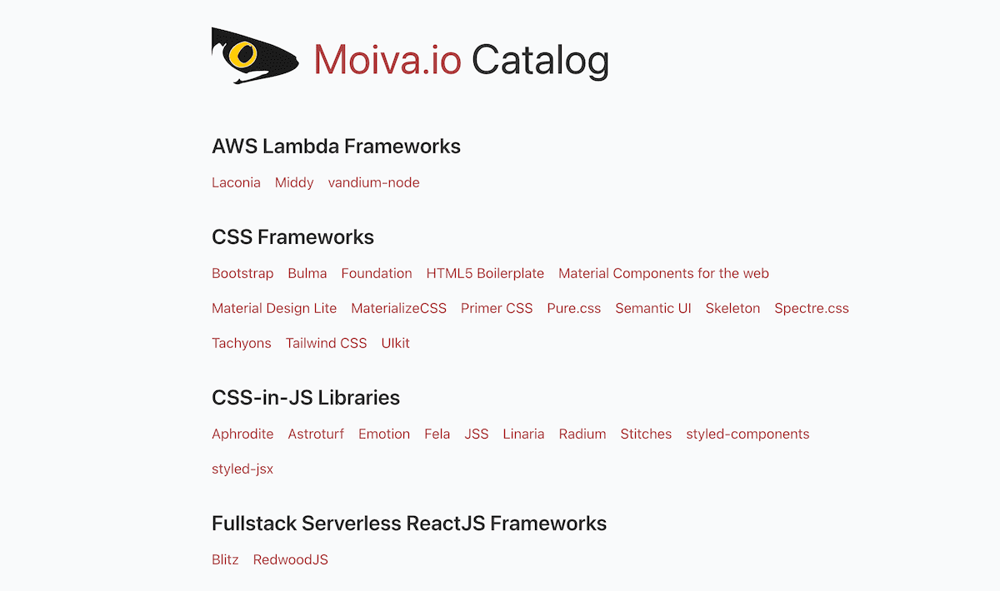
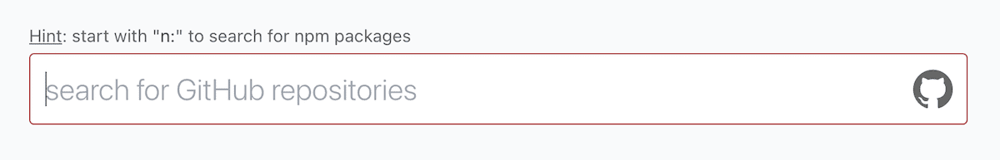
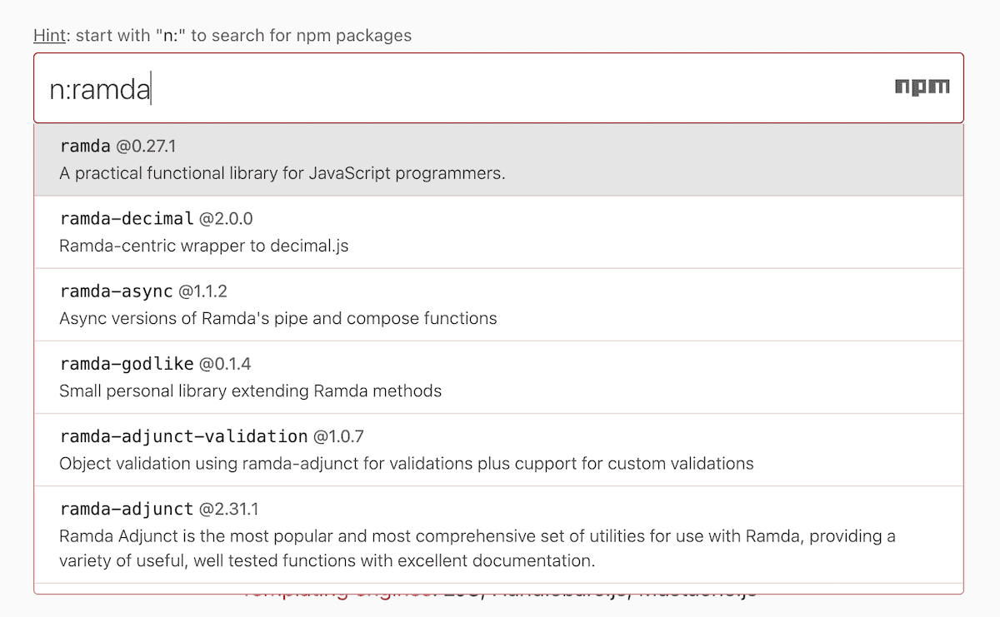
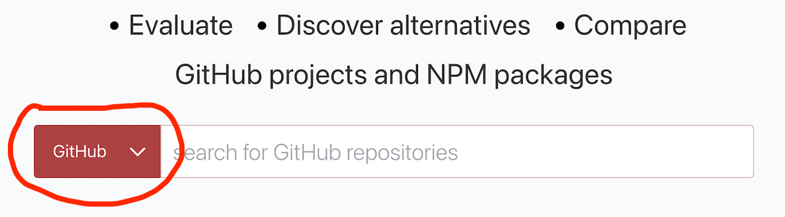
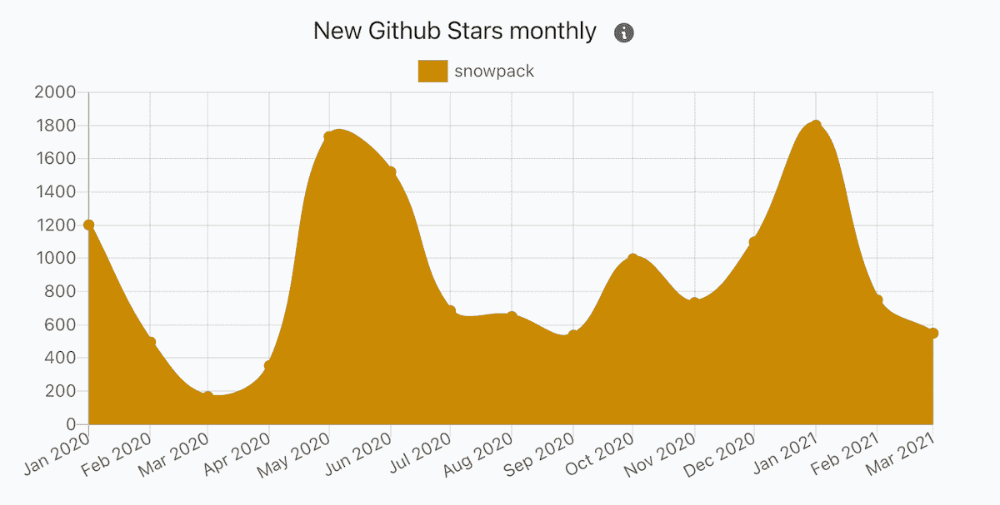
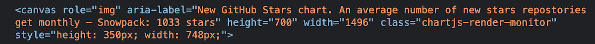
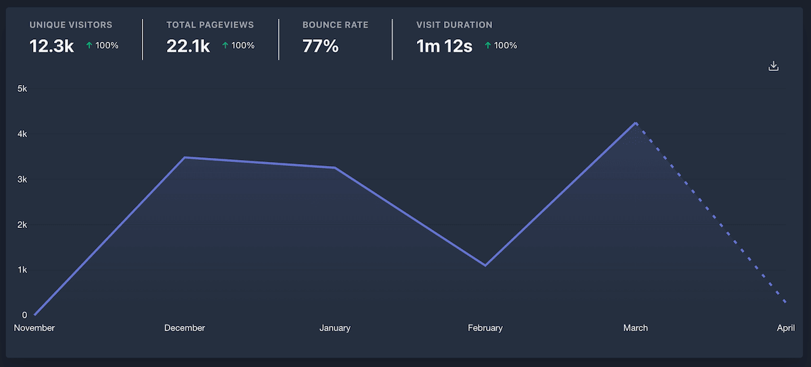

This is an April update on [Moiva.io](https://moiva.io/) development progress.

## "New GitHub Stars monthly" chart

GitHub stars is a measure of popularity and Moiva has been showing stars counts right from the beginning. The problem though is that the bare amount of stars does not really reflect how popular a project is at the moment.
Who knows, maybe a popular in the past project was deprecated and in that case it would be wrong to rely on that metric as a measure of popularity.

What's more important and interesting is to see how many stars a project gets right now and how that value changes with time. I thought it would be really cool to get such data, visualize it and enable users to see popularity trends and compare them between alternative projects.

Hence, meet a new chart in our Popularity category - "New GitHub Stars monthly".

In terms of implementation, it was probably the most difficult chart so far. It underwent several implementations before I got satisfied with the results.

GitHub provides `stargazers` REST api which retrieves a list of users who starred a repository, but without dates. Soon I found that the API does provide the dates if a specific header is provided. But then a new problem came in - the api has a 400 pages limit. It means that I can get only the first 400\*100=40k stars which imposed a significant problem for old good projects with >40k stars.

I looked around and found that GitHub GraphQL API provides the required data without such limits. It solved half of a problem - finding a data source. Then I had to come up with a clever plan on how to use that API in a way that I don't reach GitHub's rate limits and the data are served fast to users. Thanks to [Cloudflare KV Data Store](https://developers.cloudflare.com/workers/learning/how-kv-works) I avoided the hassle of setting up a database and learning its APIs. Moiva fetches stars data in batches and uses KV as a storage.

## New "Catalog" page

If you already used Moiva then you know that when evaluating certain libraries you get a list of suggestions for comparison. Besides, Moiva shows a category of the selected libraries.

That information comes from Moiva's [Catalog](https://github.com/aantipov/moiva-catalog).

My idea was that the Catalog might be useful to users on its own and it is worth exposing it.

So I created a [Catalog](https://moiva.io/catalog) page that lists all the libraries grouped into categories.

## New GitHub/NPM switch control

Back in February, when I announced the possibility of searching for, evaluating, and comparing any GitHub projects, I made GitHub a default Moiva search.

Search for npm packages was preserved and users could activate it with a simple `n:` prefix. I added a hint above the search field to let users know about that possibility.

Then I checked statistics and found that only 10% of searches are npm-searches. It looked strange to me, because I believe most of Moiva users at this stage come from JavaScript ecosystem and they should be interested more in searching for NPM packages rather than GitHub repositories. Search for NPM packages has one advantage - users can see NPM-related statistics like NPM Downloads and NPM releases.

It seemed that users didn't pay attention to the tiny hint and they were not aware of the possibility to search for NPM packages.

I decided to made the search type switch more prominent and "user friendly" - using a dropdown selector.

The statistics say that the implemented change works - 40-50% of search requests are NPM searches.

## Accessibility for all

I believe accessibility is important, especially for projects that rely heavily on a visual representation of data.

Charts play a crucial role in Moiva and it was important to make them accessible. I added a special `aria-` attribute to every chart and provided an aggregated description based on the contents of each chart.

For example, for the following chart

Moiva provides the following description

## Moiva blog featured on the Hacker News main page

Having migrated Moiva's apis to Cloudflare Workers, I decided to share my knowledge and wrote an article [Vercel Serverless Functions vs Cloudflare Workers](https://moiva.io/blog/vercel-serverless-functions-vs-cloudflare-workers).

I was pleased to see a good reception of it at Hacker News - the article got a bunch of comments and was even featured on Hacker News' main page.

## Traffic

In terms of traffic, March was the most successful month so far with 4252 visitors.

## Last but not least

Worth mentioning some of many other updates and changes:

- I added Open Graph metadata to help Moiva get more traction in social media.
- I "fixed" the old issue with the confusingly small size of React. It includes now the size of React-Dom package as well.
- NPM fixed the issue with one of their apis which caused problems for "NPM Releases" chart.
