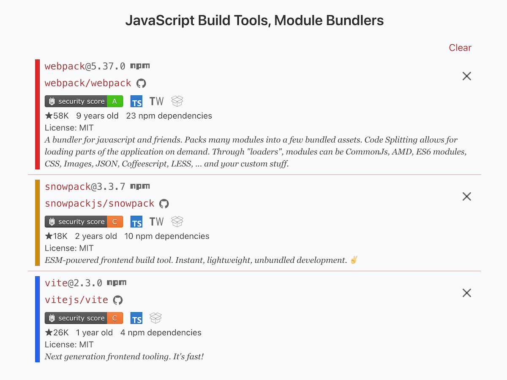
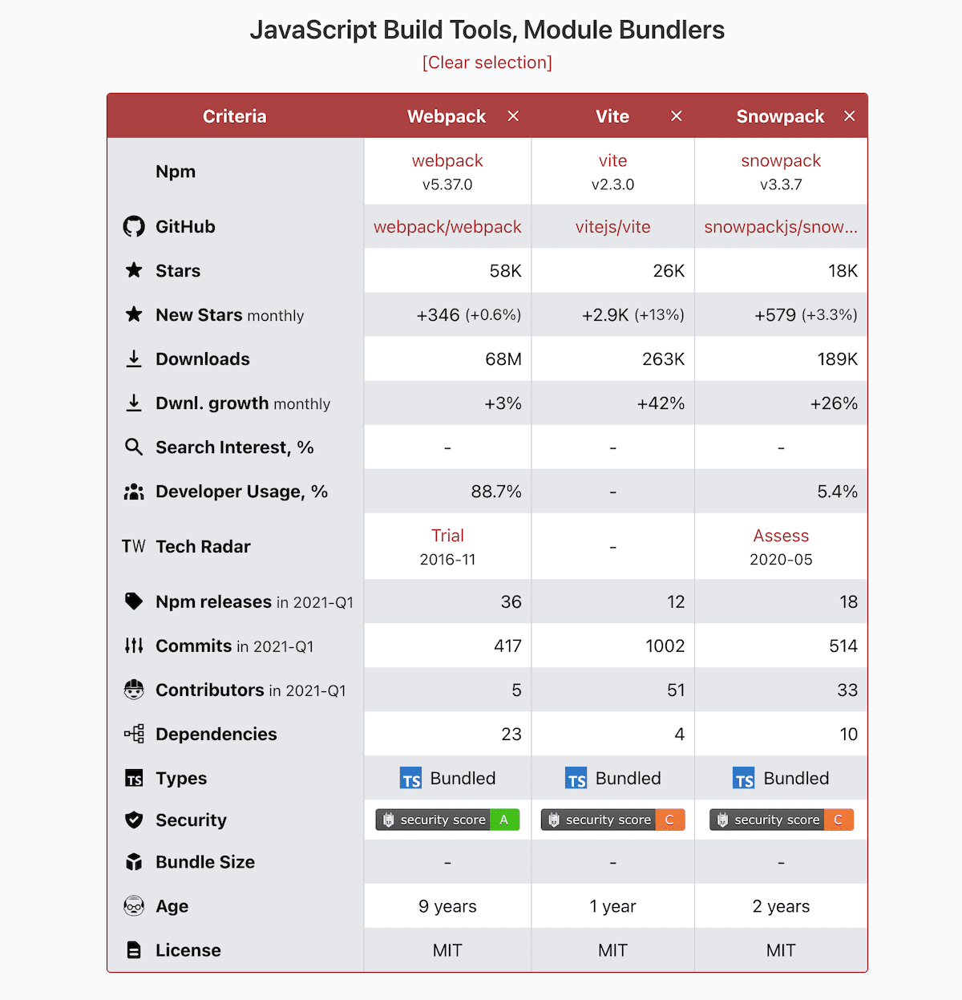
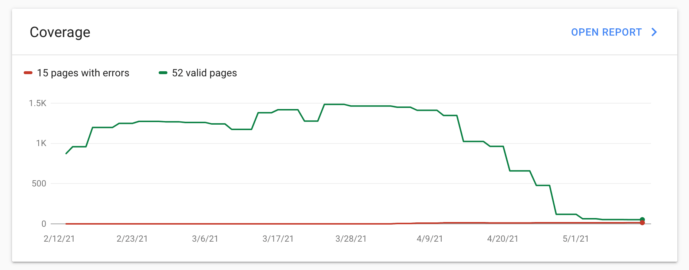

This is a May report on the progress of Moiva.io and other things I’ve been working on.

## Q1 2021 reports were published

Moiva provides a wealth of historical data for a variety of metrics. At the end of March, I had an idea: why not compile the data and make a report revealing the performance of different libraries and frameworks in Q1 2021.

The idea appealed to me also for another reason - I saw it as a test drive for Moiva, and I wanted to see what kind of valuable knowledge could be obtained from Moiva.io and what kinds of reports could be produced.

As a result, I published six reports for different categories of JavaScript libraries:

<!-- - [Q1 2021 State of JS Frameworks]()
- [Q1 2021 JavaScript State Management Libraries report]()
- [Q1 2021 JavaScript Testing Libraries and Frameworks Report]()
- [Q1 2021 JavaScript Build Tools and Module Bundlers report]()
- [Q1 2021 Static Site Generators (JAMStack) report]()
- [Q1 2021 JavaScript End-to-end Testing frameworks report]() -->

<Tweet id="_aantipov/status/1381917386312462339" />

The outcome surprised me. I discovered how much new and valuable information could be extracted and nicely presented. It also taught me that although seeing graphs with historical data is helpful, it isn’t always sufficient. Sometimes seeing raw numbers that reflect the current state and comparing them side by side is more beneficial.

I realized that tabular data can be an excellent supplement to charts.

## A guide to migrating from VueCLI to Vite

While migrating Moiva from VueCLI to Vite, I found a lack of articles explaining how to do it.

[Vite](https://vitejs.dev/) is a new and trendy tool these days, and I figured such a guide could be really useful for Vue users.

<!-- Hence I wrote [my own guide](). -->

## Moiva.io updates

**Migration to Vite**.
[Vite](https://vitejs.dev/) had been on my radar for a while, but I had no plans to migrate to it. It didn’t look mature enough to replace huge chunks of development setup - Webpack, Babel, and so on.

The idea of migration came out of the problem I met. I was trying to update project dependencies when I run into a conflict between a set of dependencies. I struggle with similar conflicts on a regular basis at work, and I didn’t want that to be a part of my hobby project. So I decided to give Vite a chance.

Surprisingly, the migration went almost seamlessly and the result was fantastic - the startup time is next to zero, updates are reflected instantly in the browser and I ditched a lot of my previous dependencies.

<Tweet id="_aantipov/status/1385326827120599041" />

**Tabular data representation**. As I described above, the published series of reports taught me two things:

- Moiva’s data allows it to extract much more useful information than is currently shown.
- tabular data representation can be an excellent supplement to graphs.

I liked the table view in the reports so much that I replaced the old list view with it in Moiva.io.

This is how it looked before:

This is how it looks now:

The new table view is much more in line with the project’s goal of making software comparison simpler.

## SEO

It was a disastrous month for Moiva in terms of Google Search performance. The coverage dropped from 1.5K to 50 pages.

As a consequence, Google doesn’t suggest Moiva.io in search results when people look for software comparison.

Google seems to have made some changes to their engine, and the majority of Moiva’s pages are now being treated as duplicates. I believe it was due to Moiva’s emphasis on graphical data representation (rather than textual). Despite the fact that all of Moiva’s charts are accompanied by accessibility information, Google appears to have difficulty parsing and understanding graphical data. As a consequence, all the pages look the same to Google.

I hope the introduction of the table view will improve the situation.

Another factor that may have contributed to the issue is the change of the structure of Moiva’s URLs which I made at the start of the year: the `compare` parameter was replaced with a combination of `npm` and `github` parameters. I had two options to avoid penalties from Google:

- implement 301 redirect
- provide [`rel="canonical" link tag`](https://developers.google.com/search/docs/advanced/crawling/consolidate-duplicate-urls#rel-canonical-link-method) for the pages with old URLs

The first option was impractical because Vercel does not allow the use of URL query parameters in their [redirect logic](https://vercel.com/docs/configuration#project/redirects). So I went for the second option: Moiva computes the canonical URL and inserts the required `link` tag in the page’s `head` section during page load. However, it appears that Google is still not very good at parsing that link tag when added by javascript - many pages are marked as "_Duplicate without user-selected canonical_".

I’m considering switching from [Vercel](http://vercel.com/) to [Netlify](https://www.netlify.com/) to overcome the issue using 301 redirects and to address some of Vercel’s other limitations. Netlify seems to be a more mature solution in several aspects.
