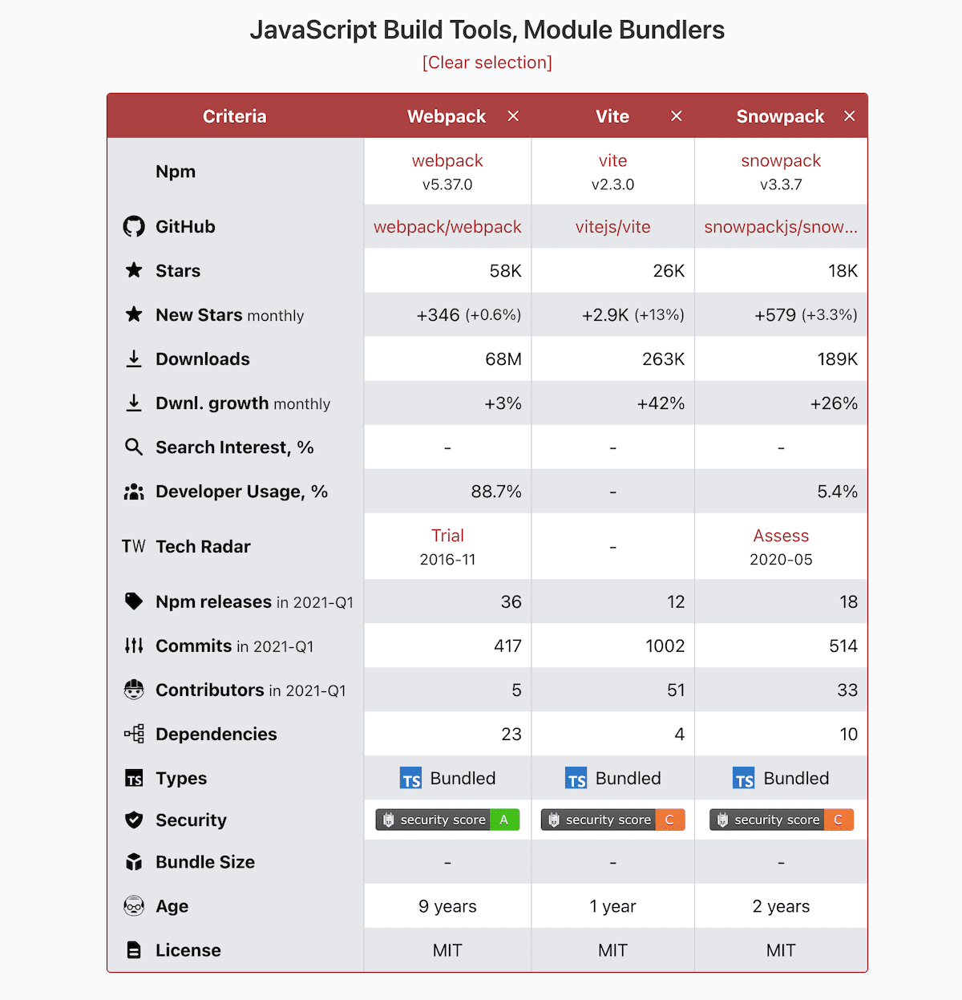
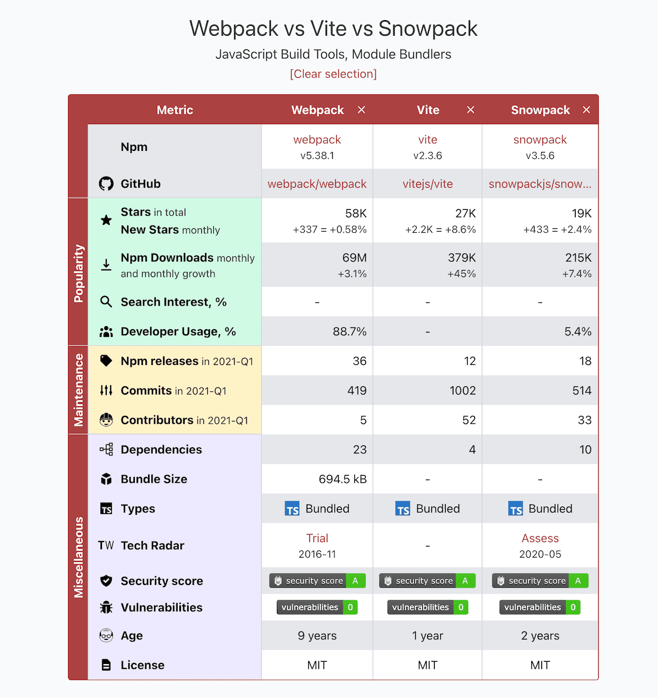
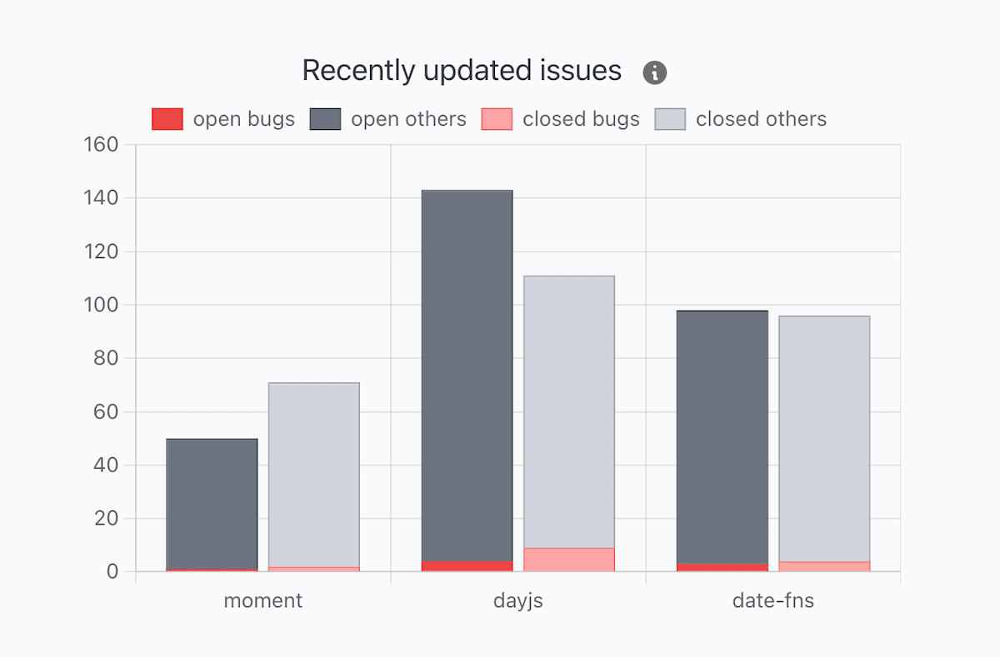
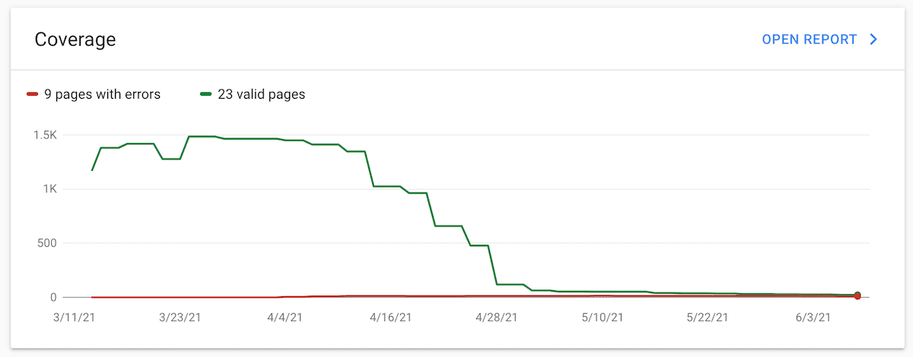

This is a June report on the progress of [Moiva.io](http://moiva.io).

## Improved table view

About a month ago I introduced a table view for presenting data. I found out that it brings a lot of value and I gave it a central place. The Charts are mainly used to present historical data and are helpful in seeing trends. The Table serves as a snapshot of the current situation. Hence, the Table and Charts perfectly complement each other.

Moiva evaluates Npm packages and GitHub repositories using roughly 20 metrics. And the number keeps growing. To help users navigate through those metrics, I grouped them into three categories: "Popularity", "Maintenance" and "Miscellaneous". Each category got highlighted with a different background color.

"Stars" and "New Stars" metrics were combined into a single row. The same was done for "Downloads" and "Downloads Growth".

I also added a new metric called "Vulnerabilities". It shows a number of vulnerabilities in the repository. Thank you to [Snyk.io](https://snyk.io/) for providing the data.

<!--  -->

## "Issues" chart removal

The "Recently updated issues" chart was available on Moiva.

My idea was to show the number of bug reports and other types of issues being opened and closed. It should have indicated how quickly the issues are being resolved, as well as a proportion of bugs to the remainder of the issues.

At the time I implemented the chart I was struggling to find proper data. I chose an API that provided a list of repository issues sorted by the last update date. The combination of that data with the issues' statuses and labels should have yielded a good approximation of how many issues are being opened/closed.

Later on, I discovered I was wrong. I examined data from a number of well-known repositories and noticed that many old closed issues were constantly being updated, primarily due to new comments. It made the issues appear in Moiva as "recently closed", undermining the chart's main purpose.

I decided to remove the chart and come up with more meaningful issues metrics later.

## Migration to Netlify

Moiva was migrated from Vercel to Netlify.

I was hoping that migration would help me fix some of Moiva's SEO issues. I found out I was too optimistic; their redirection logic constraints don't make my situation any better.

Nevertheless, I think I've discovered a solution. Netlify is implementing a new feature called [Edge Handlers](https://docs.netlify.com/routing/edge-handlers/). It will allow intercepting and modifying requests and responses on the fly, which should be enough for me to implement the required redirection logic and add the necessary headers to responses.

## SEO fixes

Moiva is a single-page application (SPA) without server-side rendering (SSR). Because Google has historically favored server-rendered web pages, such architecture comes with a set of SEO issues.

Moreover, Moiva had content-related SEO issues: Google considered Moiva's pages to be of low value because of their emphasis on graphical representation of data. The charts use `<canvas />` elements, which Google cannot read, and I made the mistake of not giving it a textual fallback. Charts accessibility attributes like `aria-label` were apparently of no help there.

As a result, Google flagged Moiva's pages as duplicates, and they were removed from the Index.

I took a number of steps to resolve the problem.

- dived into SEO topic to figure out what and how I can improve.
- made sure Google understands the Table view by properly labeling the headers and providing the [`scope`](https://developer.mozilla.org/en-US/docs/Learn/HTML/Tables/Advanced#the_scope_attribute) attribute.
- all charts received fallback textual information.
- improved the page's internal structure by careful use of headers and sections.

<!-- {} -->

Along the way, I refactored the code and extended the usage of [Vue's Reactivity APIs](https://v3.vuejs.org/api/basic-reactivity.html). I love it! It greatly simplified the logic, eliminated a number of pain points, and made it possible to build more advanced functionality in the future.

<!-- {} -->

It is still too early to say if my tweaks helped in any way in improving the SEO. Keeping my fingers crossed 🤞

## "Recommended reading" section

Moiva aims to evaluate libraries as comprehensively as possible, using different sources and types of data, as well as different data representations and perspectives (snapshots, changes over time). It should allow developers to form their own opinions regarding libraries and how they compare to one another.

Having said that, there are still areas unreachable for Moiva and there is sometimes a need for expert judgment and a walk-through in-depth analysis. To address these gaps I added a new section called "Recommended reading", which will suggest links to high-quality content relevant to the selected libraries.

At the moment there is only a link to a nice article [JavaScript Frameworks, Performance Comparison 2020](https://javascript.plainenglish.io/javascript-frameworks-performance-comparison-2020-cd881ac21fce) by [@RyanCarniato](https://twitter.com/RyanCarniato). More links will be added in the future. Any suggestions here are very welcome.

## Repositories names update

Names of repositories are often modified. The most frequent changes:

- moving a repository under a different organization account
- changing letters case

For Moiva, such changes are an issue.
Moiva uses its [Catalog](https://moiva.io/catalog/) to categorize popular libraries, provide suggestions to users, and establish connection between repositories and npm packages.
Whenever a repository from the Catalog is renamed, Moiva is unable to locate it there and, as a result, cannot provide suggestions and load npm package data.
The user experience suffers, and SEO might also be affected.

Therefore it is important to maintain the names of repositories in the Catalog up-to-date.

## Utility scripts in Deno

I normally write NodeJS scripts for things like updating repositories' names. One of my pain points was the lack of TypeScript support. I realized that I became a TypeScript addict and desperately need it everywhere.

I decided to give [Deno](https://deno.land/) a try, and it did not disappoint. TypeScript support out of the box and built-in `fetch` change the game.

## Kudos

Moiva is young and has little exposure; its current audience is small. Every user and supporter is extremely important. I'm grateful to everyone who helps spread the word and makes Moiva better by providing valuable feedback and pointing out issues.

I'd like to highlight the following wonderful people:

- [@magnemg](https://twitter.com/magnemg) and [@dcorbacho](https://twitter.com/dcorbacho) for the continuous help with spreading the word about Moiva.
- [@muratsutunc](https://twitter.com/muratsutunc) for the feedback and pointing out the problem with legacy libraries.
- [@devtheory\_](https://twitter.com/devtheory_) for publishing a youtube video with Moiva (starts at 8:35)
  <!--  -->
