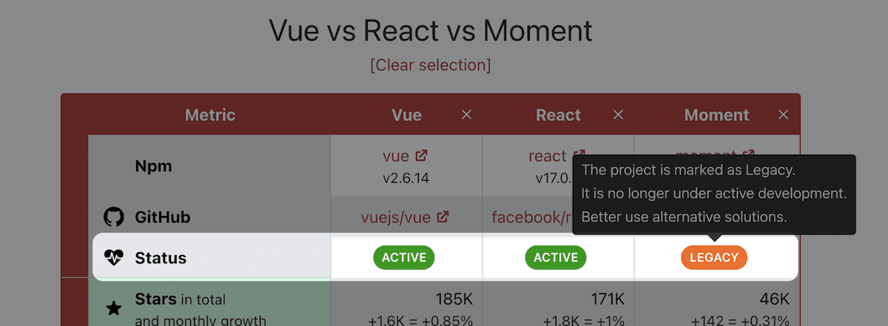
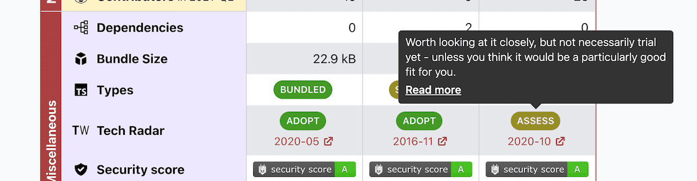

This is a July report on the progress of [Moiva.io](https://moiva.io/).

## New metric "Status"

Users asked for an indication to identify libraries that are no longer active or have been deprecated.

I added a new metric and called it _"Status"_.

Four possible values:

- ARCHIVED, if repository is archived
- LEGACY, if Library authors marked it so
- INACTIVE, if there were no commits in the last 6 months
- ACTIVE, otherwise

There is no API to determine if a particular library is marked legacy. Hence, such information is maintained manually.

## UX improvements

I made small UX improvements to help users get the most out of the Table view.

- metrics "_Types_", "_Tech Radar_" and "_License_" were converted into badges of different colors depending on the value
- each badge got a tooltip
  

- external links acquired a distinct icon

## Chore and misc

- added a bunch of new libraries to the catalog.
- used json files for manually maintained data.
- added a bunch of tests for manually maintained data.
- refactored and cleaned up the code in many places.
