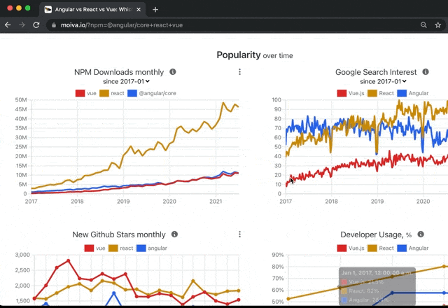
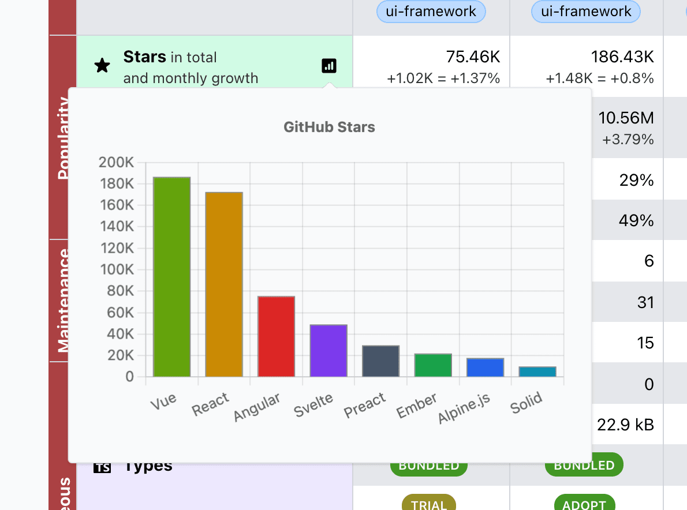
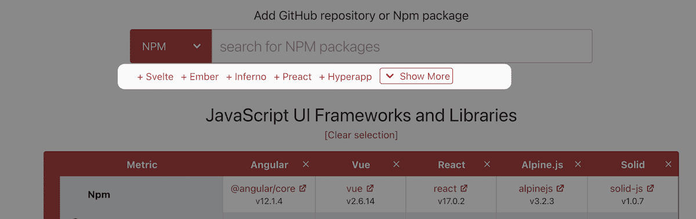
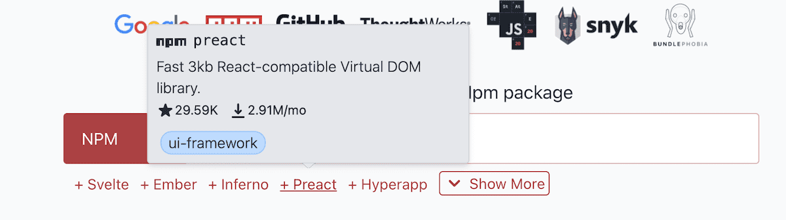

This is an August report on the progress of [Moiva.io](https://moiva.io/).

## Copy/download/share charts

This is the feature I'm mostly excited about - all charts now include a popup menu that allows users to copy charts to the clipboard, share charts on Twitter, and download charts.

It should make it easier for users to use the findings of comparisons elsewhere.

## A chart for every metric in the Table

A table view is useful for presenting static and numerical data. When the number of libraries in comparison is small, it serves the purpose very well. As the number of libraries increases, it becomes more difficult to make sense of the raw figures. This is where graphical data representation would be very beneficial.

Thinking that way, I added a small icon to every numeric metric in the Table. Clicking on the icon invokes a pop-up window with a bar chart where all the libraries are sorted by the metric’s value.

## New Suggestions mechanism

When a user evaluates a library, Moiva suggests alternatives to compare.

In the past, the mechanism of suggestions used Moiva’s Catalog which categorised its libraries. The process of adding new libraries was tiresome because the mechanism had several downsides:

- every library had to belong to only one particular category. Choosing a category or creating a new one was a non-trivial task. For example, should React and Vue date-picker libraries belong to one category or different categories? Should Express and NextJS belong to the same category?
- the catalog was maintained in a [separate repository](https://github.com/aantipov/moiva-catalog), each Category had a separate file, and from time to time I had to compile it and put it to Moiva’s repo.

To facilitate adding new libraries, I refactored the Catalog:

- to use Tags instead of Categories: each library is assigned a number of tags, not a Category
- store the libraries as a plain list in a single file under the Moiva's repository
- use tags of selected libraries to suggest alternatives
- sort suggestions based on “similarity” to the selected ones. The more tags a library has in common with the tags of selected libraries, the more “similar” it is.

In the future, I plan to include GitHub Stars and Npm Downloads numbers, and libraries statuses to improve the sorting algorithm.

## Tooltips in Suggestions

Before adding suggested alternatives to comparison, it might be helpful to glance quickly at the descriptions and other details of the libraries, such as the number of Stars and Npm downloads.

On that basis, I added tooltips to the list of suggested alternatives. The tooltips contain the following information:

- name
- description
- stars and npm downloads numbers
- tags

## “About” page

Every respectable web app must have an "About" page. And so does Moiva - [https://moiva.io/about/](https://moiva.io/about/).
