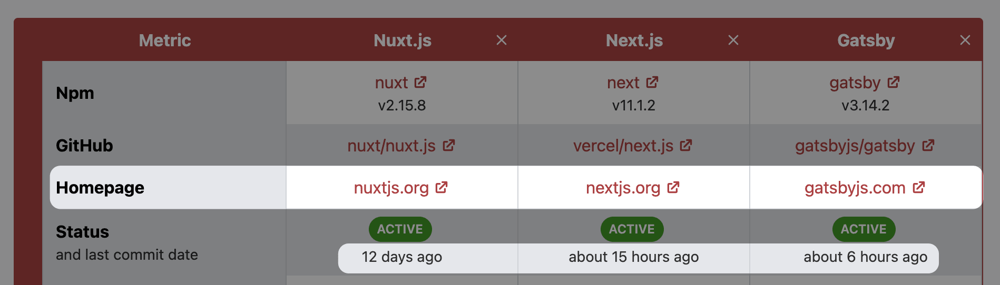
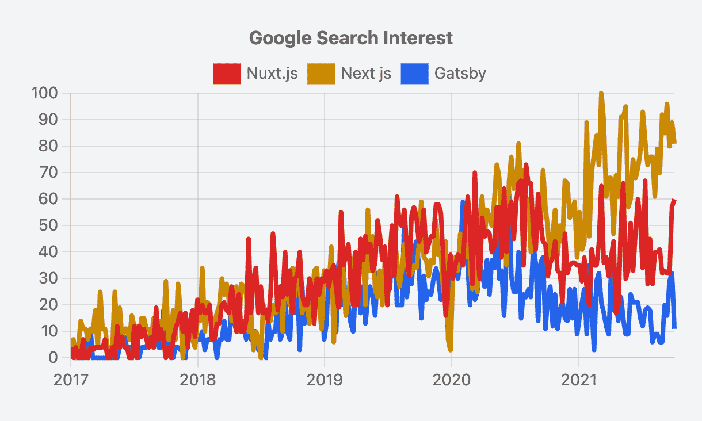
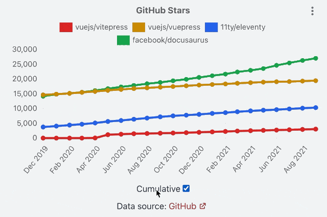
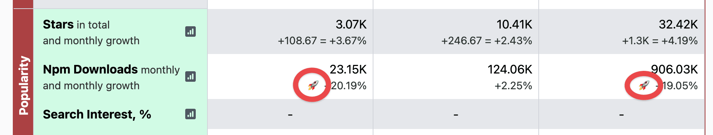
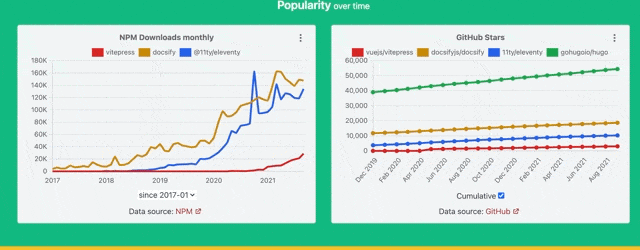
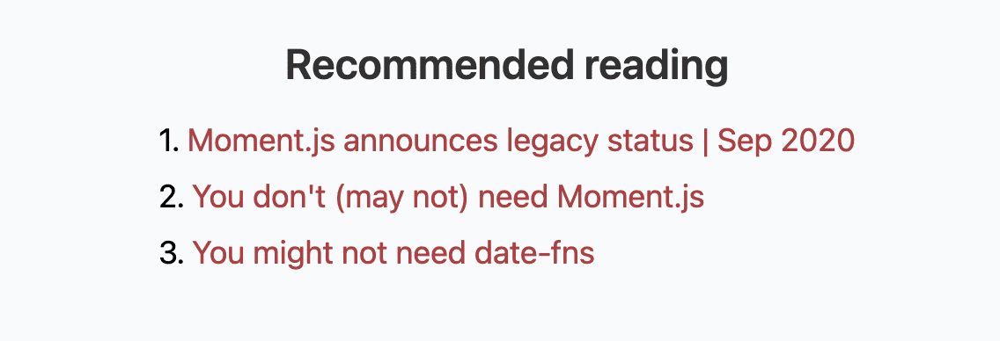

This is an October report on the progress of [Moiva.io](https://moiva.io/).

## Library Homepage link and Last Commit date

In response to several requests, I included links to the homepages of libraries to the Table.

In addition, the last commit date was added under the status label.

## Charts improvements

You probably have noticed that when you generate the chart’s image using the chart’s menu (the “three-dots” button), the title is missing in the image.

The issue has been resolved, and the title is now visible in the produced image.

All the charts were refactored to have a consistent look and behaviour.

Charts descriptions were moved from the tooltips to the bottom.

Chart filters were also moved to the bottom.

## "Cumulative" charts option

Moiva has the _“New GitHub stars monthly”_ chart showing the rate at which new stars are acquired by a library on a monthly basis.

New stars rate reflects current popularity more precisely than a total number of stars.

Sometimes though it’s more interesting to look at the big picture and observe how the overall number of stars changes over time. And some users have already asked for that.

I added a “Cumulative” control to quickly switch between the two modes.

I wanted to add a similar control to the _“Contributors”_ chart but turned out that it’s not that simple. After a prolonged conversation with GitHub Support, I realized that the API I use doesn’t suit the cumulative version of the chart. The proper implementation seems a bit complex. So I decided to put the implementation of this idea on hold.

## Signifiers for Trendy libraries

The Table presents a lot of factual numerical information. To help users make sense of that information, Moiva does the following:

- information is divided into three categories “Popularity”, “Maintenance” and “Miscellaneous”. Each category is highlighted by a distinct color.
- red is used to color statistics that have a “negative” connotation (for example, large numbers of dependents or negative download growth).

I started to use another signifier, a rocket symbol 🚀, to draw attention to trendy libraries.

## Colorised charts sections

For each comparison, Moiva presents 6 to 9 charts and it might be difficult to digest them all at once and make proper associations between them.

Even though the charts are organized into categories (“Popularity”, “Maintenance”, and “Miscellaneous”), it does little help to mobile users - the category title slides out the viewport when scrolling to a second-third chart in the category.

For each category section, I assigned a distinct background color to put more emphasis on the category of a particular chart and help users split the page into logical parts.

I like the colorised sections a lot! They bring more joy.

## Back/Forward navigation

Back ⏪ and Forward ⏩ browser buttons have never worked and users reported the issue several times.
I finally made them work 🙂

## You don’t need X

Usage of tools like Moment and Lodash is often unjustified.
That’s why I love resources like [https://youmightnotneed.com](https://youmightnotneed.com)

- try to implement things natively first
- reach out to external tools only when they bring value

Moiva started to recommend such resources in the _“Recommended reading”_ section when evaluating the corresponding libraries.

