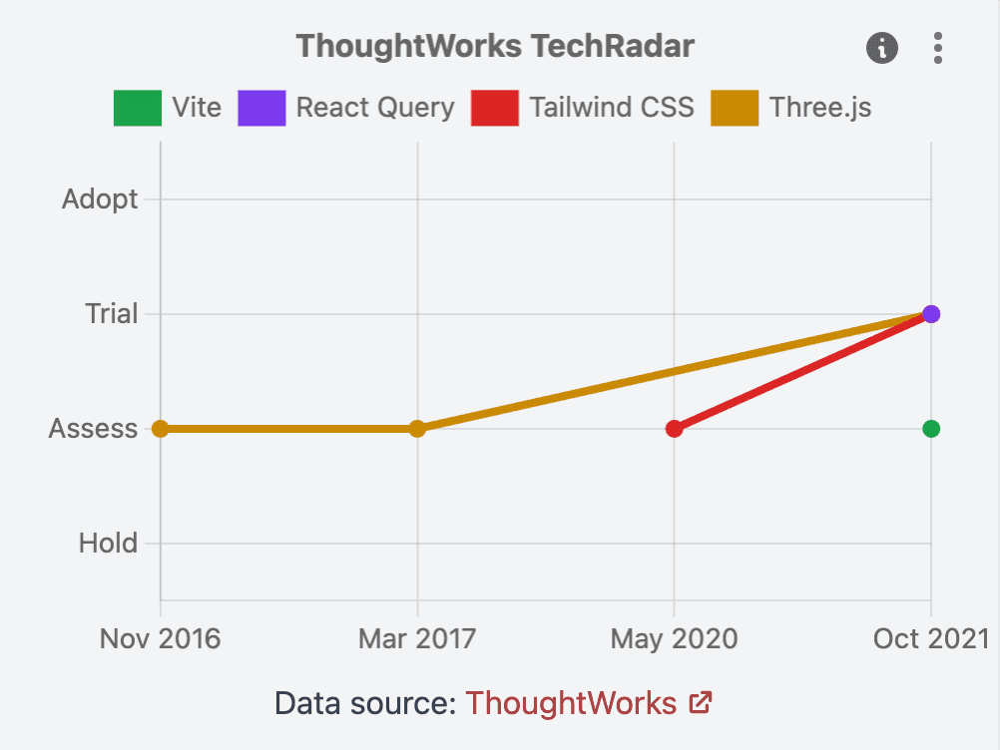

This is a December report on the progress of [Moiva.io](https://moiva.io/).

## Migration to VitePress

There were no major feature updates in the last two months (I skipped November update), mainly because I was busy rebuilding my website [alexei.me](https://alexei.me/) with [VitePress](https://vitepress.vuejs.org/). I also set up a blog there and published a new article ["State Management: Separation of Concerns"](https://alexei.me/blog/state-management--separation-of-concerns/).

I was so excited about VitePress, that I migrated Moiva's blog from Hugo to VitePress as well. It became much snappier. But more importantly, I can write the blog now with Vue+Markdown and it integrates nicely into the Moiva's project.

## New Tech Radar data

Thoughtworks released a new version of the famous Tech Radar. I incorporated its data into Moiva.

## Other changes

Other less prominent updates:

- refactored some parts of Moiva and converted them into Vue hooks.
- new entries in Moiva's catalog
- updated project's dependencies
