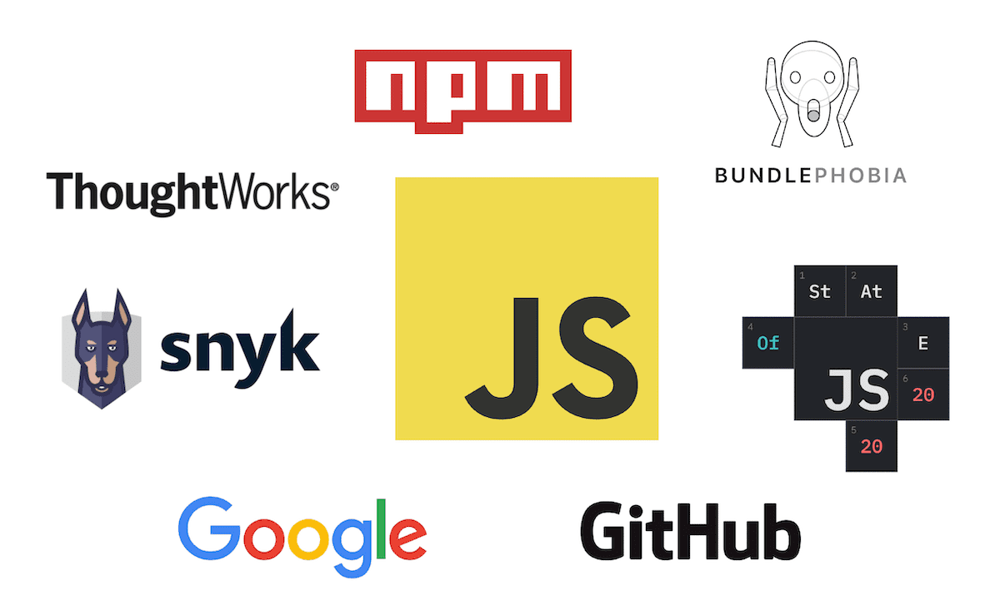
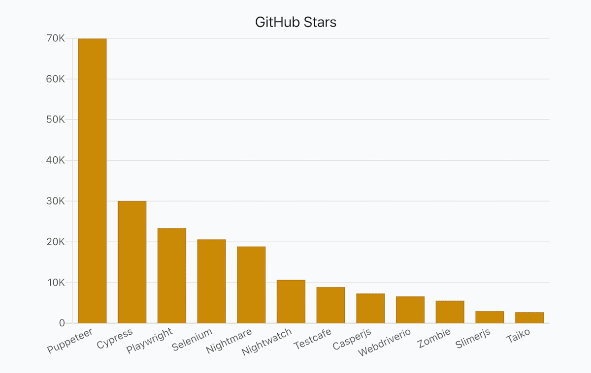
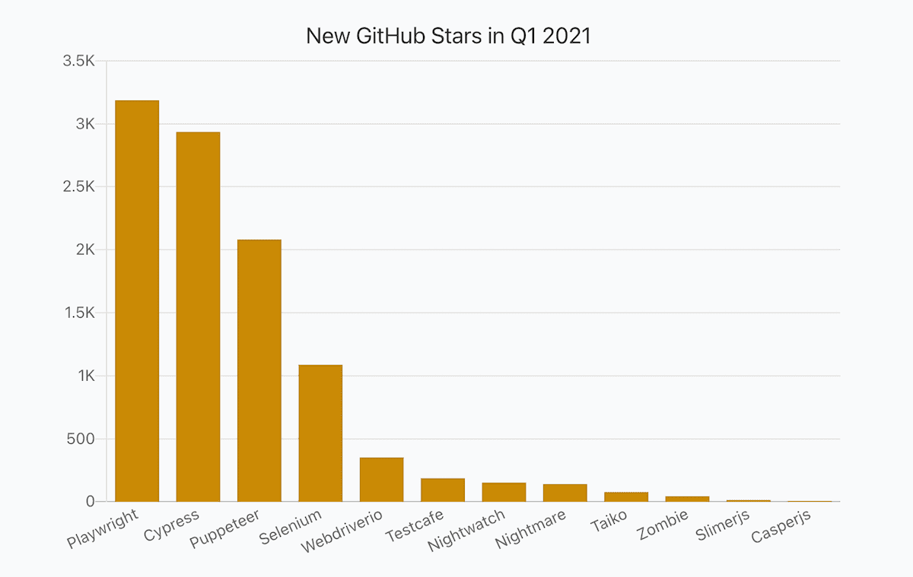
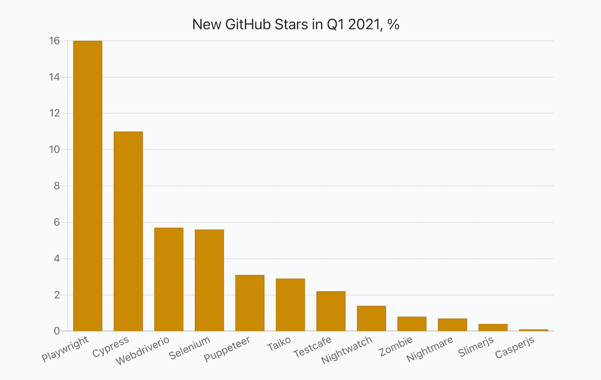
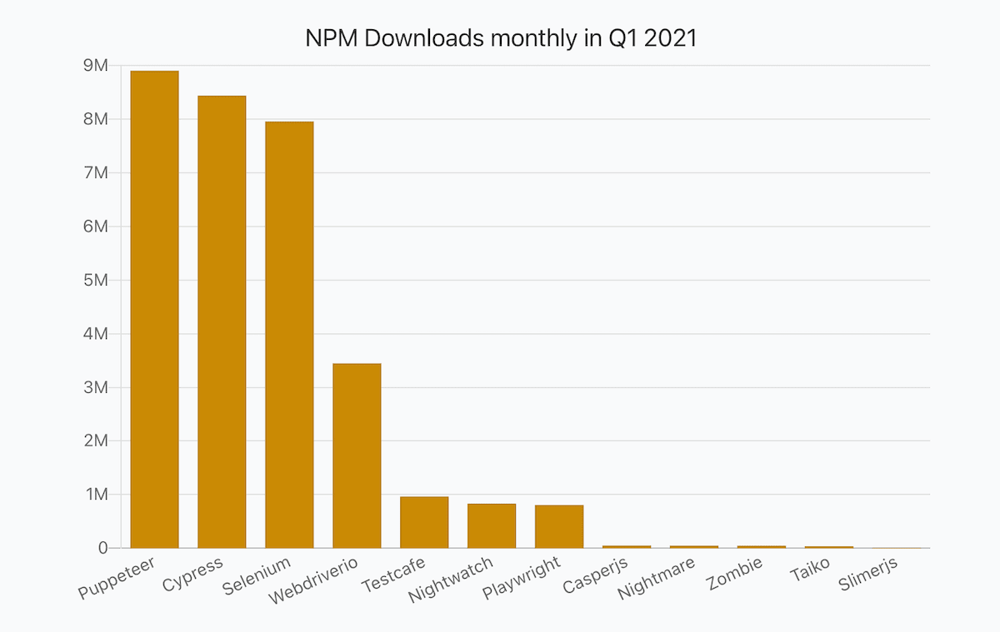
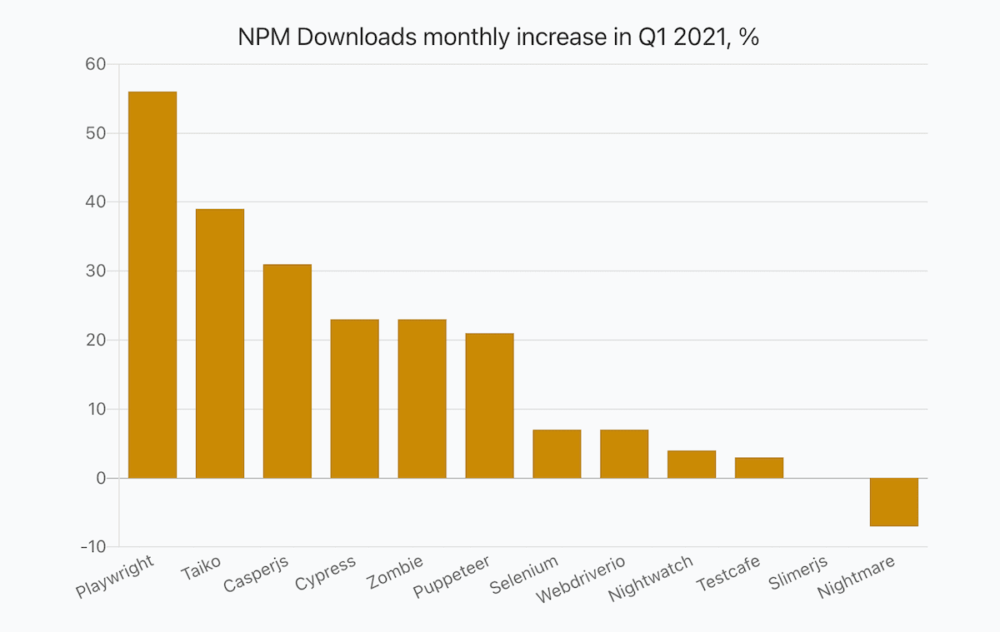
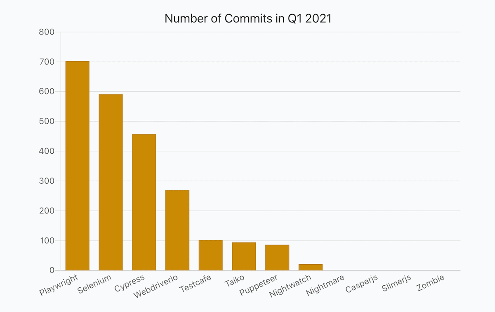
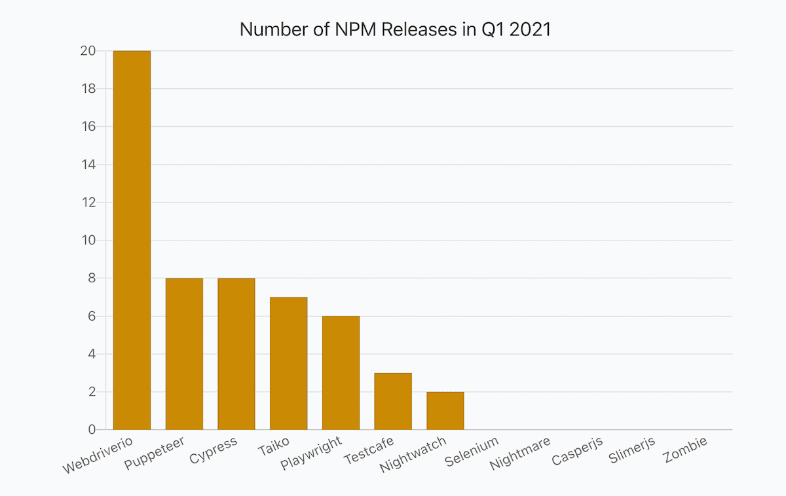
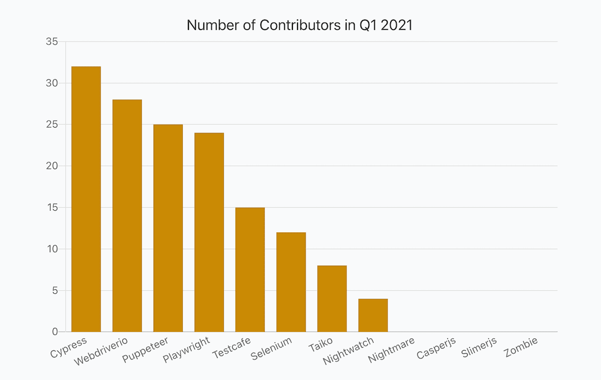

## Intro

JavaScript developers are blessed - they have multiple different tools for End-to-end testing, they have many options to choose from.

Choosing is always betting. How to bet best? How can one know which tools are popular and trendy? Which tools are actively maintained?

I wanted to answer such questions and prepared a report covering Q1 2021 period. The report uses data aggregated from many different authoritive data sources, like [ThoughtWorks](https://www.thoughtworks.com/) and [Snyk](https://snyk.io/).

If interested, I recommend checking out other reports as well: [Frontend Frameworks](https://moiva.io/blog/2021-q1-state-of-js-frameworks), [State Management Libraries](https://moiva.io/blog/2021-q1-report-state-management), [Testing Frameworks](https://moiva.io/blog/2021-q1-report-js-testing-libraries), [Build Tools and Module Bundlers](https://moiva.io/blog/2021-q1-report-js-build-tools-bundlers), and [Static Sites Generators (JAMStack)](https://moiva.io/blog/2021-q1-report-js-jamstack).

## Data Sources

Data for the report came from:

- [NPM](https://www.npmjs.com/) - libraries downloads, releases, types, and dependencies.
- Google - search interest data.
- GitHub - stars, commits, contributors, license, and age.
- [State of JavaScript Survey](https://stateofjs.com/) - libraries usage amongst developers.
- [ThoughtWorks](https://www.thoughtworks.com/)'s Technology Radar data.
- [Snyk](https://snyk.io/) - security information.

## Metrics

- _Stars_ - the total number of GitHub stars as of April 1, 2021.
- _New Stars_ - a number of new stars in Q1 2021.
- _New Stars, %_ - (100 \* New Stars) / (Stars - New Stars)
- _NPM Downloads monthly_ - an average monthly npm downloads number in Q1 2021.
- _NPM Downloads monthly % (incr.)_ - an increase of the average monthly npm downloads number compared to Q4 2020.
- _Search Interest, %_ - Google search interest average number compared to other libraries in the 01.10.2020-31.03.2021 period.
- _Developer Usage, %_ - percentage of developers using a library according to the latest StateOfJS 2020 survey.
- _ThoughtWorks Tech Radar_ - a "ring" where a library was put. ThoughtWorks distinguishes four rings - "_Adopt_", "_Trial_", "_Assess_", and "_Hold_". You can learn more about the Radar [here](https://www.thoughtworks.com/radar/faq).
- _NPM Releases_ - a number of NPM releases in Q1 2021.
- _Commits_ - a number of commits in Q1 2021.
- _Contributors_ - a number of contributors in Q1 2021.
- _Dependencies_ - a number of NPM packages a library has in its dependencies list.
- _Types_ - the way typings are provided, either bundled with the package (`BUNDLED`) or published to the [@types](https://www.npmjs.com/~types) organization on npm (`SEPARATE`).
- _Security_ - calculated by [Snyk](https://snyk.io/) a level of security (from `A` to `F`) of Npm packages based on the number of vulnerabilities and their severity. `A` - no vulnerabilities, `F` - the least secure level.
- _Age_
- _License_

## Report

_Hint_: scroll horizontally to see values for all the libraries.

Each library has two links - Moiva and GitHub links. Use Moiva link to see more data about a particular library, to see historical data and trends.

<Table />

## Popularity: GitHub Stars

Maintained by the Chrome DevTools team [Puppeteer](https://github.com/puppeteer/puppeteer) is the most starred project in this report. It has 70K stars overall.

[Cypress](https://github.com/cypress-io/cypress) with 30K stars goes second.

The new on the scene [Playwright](https://github.com/Microsoft/playwright), which is maintained by Microsoft and is just a year-old project, goes third and possesses 23K stars.

[Playwright](https://github.com/Microsoft/playwright) and [Cypress](https://github.com/cypress-io/cypress) gained the most number of stars in Q1 2021 - 3.2K and 2.9K stars respectively.

When looking at a relative growth, [Playwright](https://github.com/Microsoft/playwright) becomes a leader - it grew by 16% in Q1 2021. [Cypress](https://github.com/cypress-io/cypress) goes second with 11% of growth.

## Popularity: NPM Downloads

Surprisingly, when it comes to monthly downloads numbers, there is no much difference among the first three leaders.

[Puppeteer](https://github.com/puppeteer/puppeteer), [Cypress](https://github.com/cypress-io/cypress) and [Selenium](https://github.com/SeleniumHQ/selenium) had on average 8-9M monthly downloads in Q1 2021.

[Playwright](https://github.com/Microsoft/playwright)'s monthly downloads increased by 56% (till 806K), which is the biggest increase among other tools.

[Taiko](https://github.com/getgauge/taiko) and [Casperjs](https://github.com/casperjs/casperjs) also had a significant relative increase in npm downloads numbers - 39% and 31% respectively. But their absolute downloads numbers are much smaller - 39K and 59K (compared to Playwright's 806K).

[Nightmare](https://github.com/segmentio/nightmare)'s downloads even decreased, most likely because the project seems to be abondoned and developers started migrating to other solutions.

## Development Activity: commits, releases, and contributors

Most of the tools are in active development and had on average at least one commit per day.

[Playwright](https://github.com/Microsoft/playwright), the leader here, got 702 commits which amounts to ~8 commits per day on average.

[Webdriverio](https://github.com/webdriverio/webdriverio) released 20 versions which is significantly more than any other project.

[Cypress](https://github.com/cypress-io/cypress), [Webdriverio](https://github.com/webdriverio/webdriverio), [Puppeteer](https://github.com/puppeteer/puppeteer), and [Playwright](https://github.com/Microsoft/playwright) had 24-32 contributors which are very good numbers for any open-source project.

