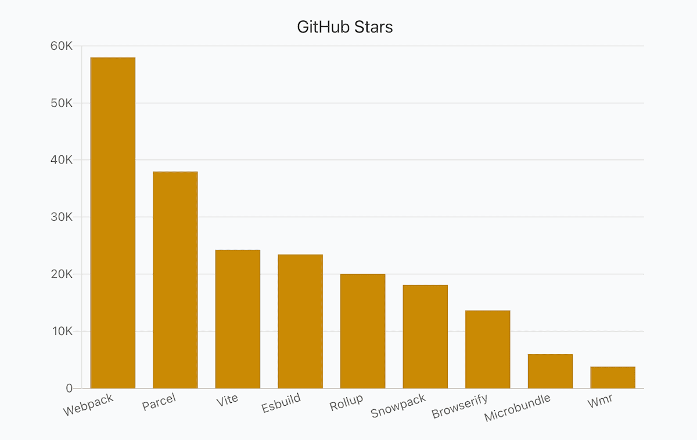
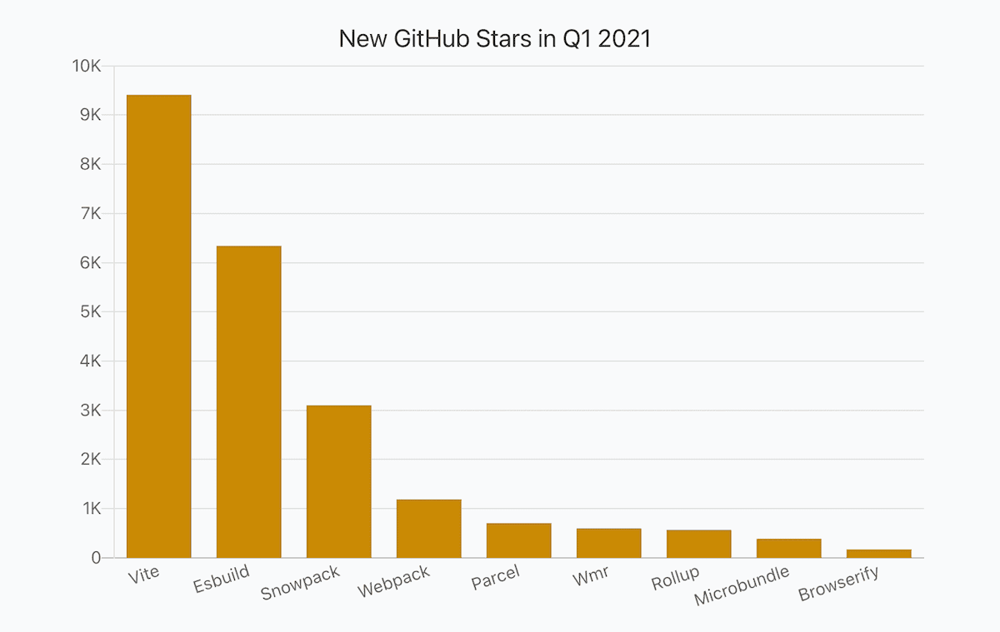
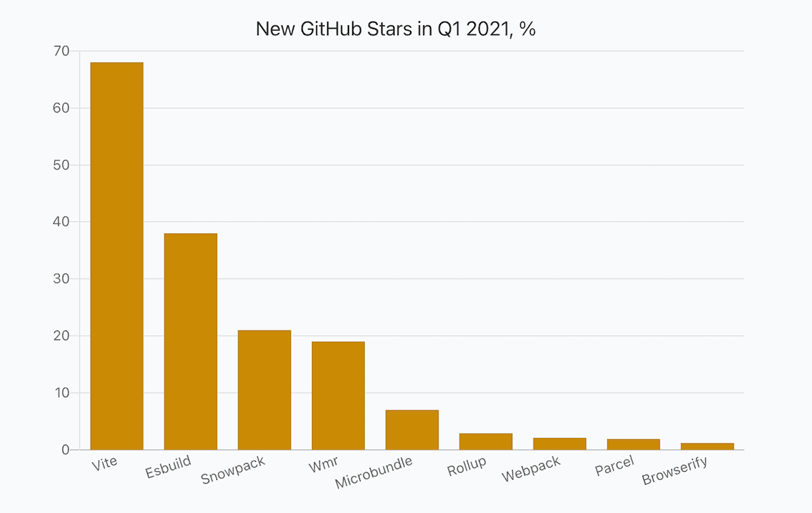
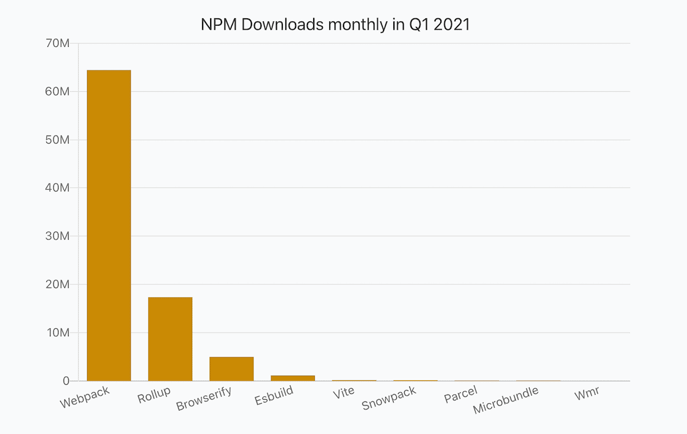
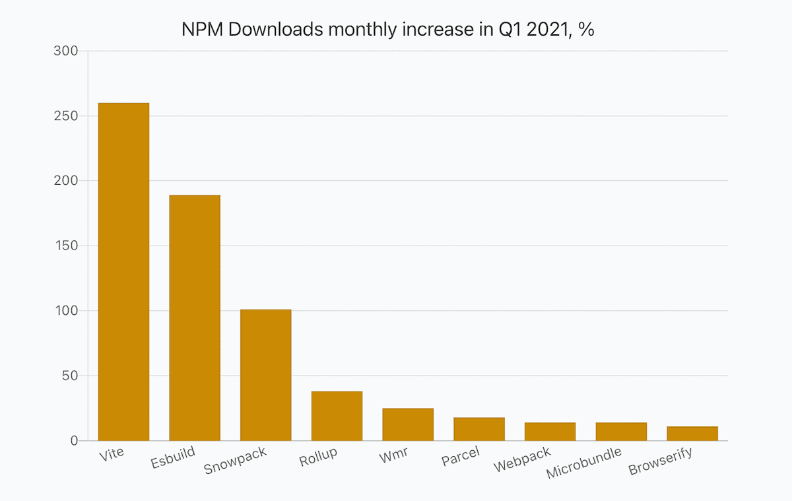
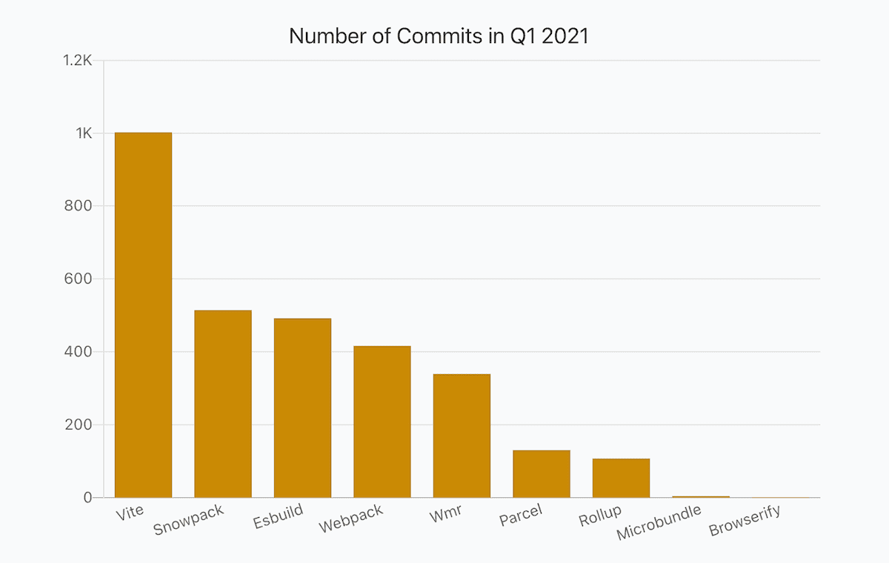
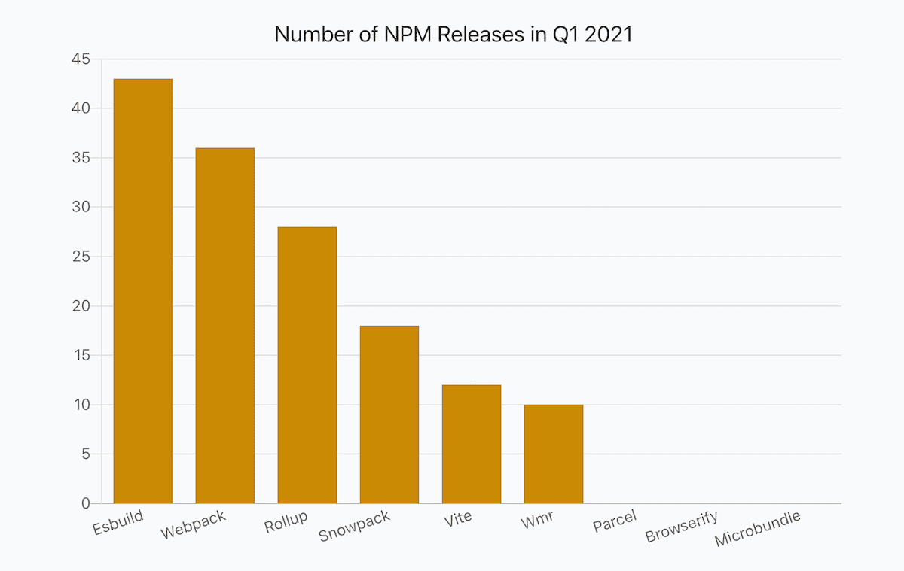
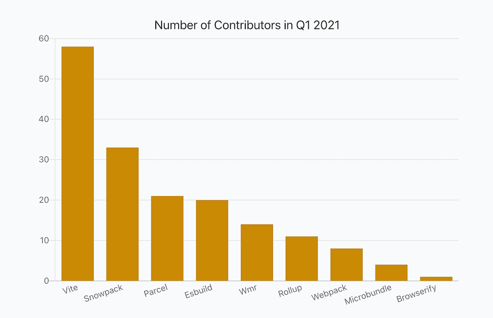

## Intro

The landscape of JavaScript build tools and module bundlers is very dynamic at the moment. Developers experiment with new approaches. Some of them look very promising and already got traction in the community.

Hence, I thought that area of JavaScript ecosystem deserves a closer look at it. It would be interesting to capture a short period of time, Q1 2021, and see what were the dynamics, have look at the tools from different angles and see how they performed, compare them side by side.

I used the same approach and the same data sources as in other reports dedicated to JavaScript ecosystem.

If interested, I recommend checking out other reports as well: [Frontend Frameworks](https://moiva.io/blog/2021-q1-state-of-js-frameworks), [State Management Libraries](https://moiva.io/blog/2021-q1-report-state-management), [Testing Frameworks](https://moiva.io/blog/2021-q1-report-js-testing-libraries), [Static Sites Generators (JAMStack)](https://moiva.io/blog/2021-q1-report-js-jamstack),
and [End-to-End Testing Frameworks](https://moiva.io/blog/2021-q1-report-end-to-end-testing-frameworks).

## Data Sources

Data for the report came from:

- [NPM](https://www.npmjs.com/) - libraries downloads, releases, types, and dependencies.
- GitHub - stars, commits, contributors, license, and age.
- [State of JavaScript Survey](https://stateofjs.com/) - libraries usage amongst developers.
- [ThoughtWorks](https://www.thoughtworks.com/)'s Technology Radar data.
- [Snyk](https://snyk.io/) - security information.

## Metrics

- _Stars_ - the total number of GitHub stars as of April 1, 2021.
- _New Stars_ - a number of new stars in Q1 2021.
- _New Stars, %_ - (100 \* New Stars) / (Stars - New Stars)
- _NPM Downloads monthly_ - an average monthly npm downloads number in Q1 2021.
- _NPM Downloads monthly % (incr.)_ - an increase of the average monthly npm downloads number compared to Q4 2020.
- _Developer Usage, %_ - percentage of developers using a library according to the latest StateOfJS 2020 survey.
- _ThoughtWorks Tech Radar_ - a "ring" where a library was put. ThoughtWorks distinguishes four rings - "_Adopt_", "_Trial_", "_Assess_", and "_Hold_". You can learn more about the Radar [here](https://www.thoughtworks.com/radar/faq).
- _NPM Releases_ - a number of NPM releases in Q1 2021.
- _Commits_ - a number of commits in Q1 2021.
- _Contributors_ - a number of contributors in Q1 2021.
- _Dependencies_ - a number of NPM packages a library has in its dependencies list.
- _Types_ - the way typings are provided, either bundled with the package (`BUNDLED`) or published to the [@types](https://www.npmjs.com/~types) organization on npm (`SEPARATE`).
- _Security_ - calculated by [Snyk](https://snyk.io/) a level of security (from `A` to `F`) of Npm packages based on the number of vulnerabilities and their severity. `A` - no vulnerabilities, `F` - the least secure level.
- _Age_
- _License_

## Report

_Hint_: scroll horizontally to see values for all the libraries.

Each library has two links - Moiva and GitHub links. Use Moiva link to see more data about a particular library, to see historical data and trends.

<Table />

## Popularity: GitHub Stars

[Webpack](https://github.com/webpack/webpack) is the oldest tool in the report (after [Browserify](https://github.com/browserify/browserify)), it is very mature and it holds the biggest number of GitHub stars, 58k stars in total.

The situation changes quickly though and new tools gain popularity at lightning speed. [Vite](https://github.com/vitejs/vite), a year-old project, has already acquired 24k stars and doesn't show any signs of slowing down - it obtained a phenomenal number of stars in Q1 2021, 9.4K stars.

[Vite](https://github.com/vitejs/vite) is not only a leader in absolute growth (by GitHub stars), but it is also a leader in relative growth. It grew by 68% in Q1 2021.

[Esbuild](https://github.com/evanw/esbuild) also grew significantly by 38%.

## Popularity: NPM Downloads

[Webpack](https://github.com/webpack/webpack)'s 64M monthly downloads leave other libraries far away. It definitely is the most adopted tool so far.

[Vite](https://github.com/vitejs/vite)'s monthly downloads increased by 260% till 168K. [Esbuild](https://github.com/evanw/esbuild)'s downloads also grew significantly by 189% till 1.1M.

[Snowpack](https://github.com/snowpackjs/snowpack) showed a nice growth of 101% till 142K monthly downloads.

## Development Activity: commits, releases, and contributors

[Vite](https://github.com/vitejs/vite) is leading in almost every metric. The same with Development Activity metric. In Q1 2021 Vite got an astonishing amount of commits, 1002 commits, that is 11 commits per day on average.
The commits came from 58 contributors.

[Esbuild](https://github.com/evanw/esbuild) on the other hand produced the biggest number of new versions - 43.

## Further Reading

If you want to see a comparison of the tools in terms of functionality, I recommend reading this nice recently published article [https://css-tricks.com/comparing-the-new-generation-of-build-tools/](https://css-tricks.com/comparing-the-new-generation-of-build-tools/).
