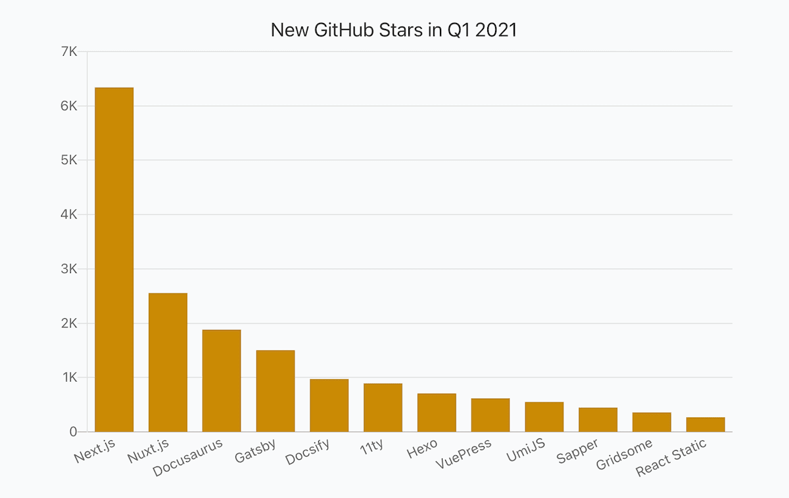
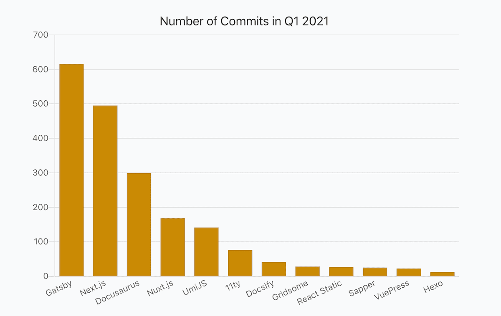

## Intro

It was 5 years ago when [Matt Biilmann](https://twitter.com/biilmann), CEO and Co-founder of Netlify, [announced](https://vimeo.com/163522126) the concept of JAMStack. The concept proved to be very useful for many use cases.

JAMStack approach continues conquering the world. Probably all major frontend frameworks support now server-side rendering out of the box and there are solutions that simplify building JAMStack websites with a frontend framework of your choice.

JAMStack tooling continues to evolve and mature. With this report, I wanted to show the current state of JAMStack tools, their stats, and trends based on fresh Q1 2021 data. To make a picture more complete I aggregated data from different authoritative resources.

If interested, I recommend checking out other reports as well: [Frontend Frameworks](https://moiva.io/blog/2021-q1-state-of-js-frameworks), [State Management Libraries](https://moiva.io/blog/2021-q1-report-state-management), [Testing Frameworks](https://moiva.io/blog/2021-q1-report-js-testing-libraries), [Build Tools and Module Bundlers](https://moiva.io/blog/2021-q1-report-js-build-tools-bundlers), and [End-to-End Testing Frameworks](https://moiva.io/blog/2021-q1-report-end-to-end-testing-frameworks).

## Data Sources

Data for the report came from:

- [NPM](https://www.npmjs.com/) - libraries downloads, releases, types, and dependencies.
- Google - search interest data.
- GitHub - stars, commits, contributors, license, and age.
- [State of JavaScript Survey](https://stateofjs.com/) - libraries usage amongst developers.
- [ThoughtWorks](https://www.thoughtworks.com/)'s Technology Radar data.
- [Snyk](https://snyk.io/) - security information.

## Metrics

- _Stars_ - the total number of GitHub stars as of April 1, 2021.
- _New Stars_ - a number of new stars in Q1 2021.
- _New Stars, %_ - (100 \* New Stars) / (Stars - New Stars)
- _NPM Downloads monthly_ - an average monthly npm downloads number in Q1 2021.
- _NPM Downloads monthly % (incr.)_ - an increase of the average monthly npm downloads number compared to Q4 2020.
- _Search Interest, %_ - Google search interest average number compared to other libraries in the 01.10.2020-31.03.2021 period.
- _Developer Usage, %_ - percentage of developers using a library according to the latest StateOfJS 2020 survey.
- _ThoughtWorks Tech Radar_ - a "ring" where a library was put. ThoughtWorks distinguishes four rings - "_Adopt_", "_Trial_", "_Assess_", and "_Hold_". You can learn more about the Radar [here](https://www.thoughtworks.com/radar/faq).
- _NPM Releases_ - a number of NPM releases in Q1 2021.
- _Commits_ - a number of commits in Q1 2021.
- _Contributors_ - a number of contributors in Q1 2021.
- _Dependencies_ - a number of NPM packages a library has in its dependencies list.
- _Types_ - the way typings are provided, either bundled with the package (`BUNDLED`) or published to the [@types](https://www.npmjs.com/~types) organization on npm (`SEPARATE`).
- _Security_ - calculated by [Snyk](https://snyk.io/) a level of security (from `A` to `F`) of Npm packages based on the number of vulnerabilities and their severity. `A` - no vulnerabilities, `F` - the least secure level.
- _Age_
- _License_

## Report

_Hint_: scroll horizontally to see values for all the libraries.

Each library has two links - Moiva and GitHub links. Use Moiva link to see more data about a particular library, to see historical data and trends.

<Table />

## Popularity: GitHub Stars

The most number of GitHub stars belongs to [Next.js](https://github.com/vercel/next.js), a React framework. [Gatsby](https://github.com/gatsbyjs/gatsby), another React framework, and [Nuxt.js](https://github.com/vercel/next.js), a Vue.js framework, go next with 50K and 36K stars respectively.

[Next.js](https://github.com/vercel/next.js) got 6.3K stars in Q1 2021 and outnumbered competitors by a convincing ~4K stars margin.

Comparing relative growth, [Next.js](https://github.com/vercel/next.js) and [11ty](https://github.com/11ty/eleventy) were on par with 11% growth. Though it's important to take into consideration, that 11% for Next.js meant 6.3K stars, while 11% for 11ty meant 891 stars.

## Popularity: NPM Downloads

Only 3 frameworks had >1M of average monthly downloads: [Next.js](https://github.com/vercel/next.js), [Gatsby](https://github.com/gatsbyjs/gatsby) and [Nuxt.js](https://github.com/vercel/next.js).

[Next.js](https://github.com/vercel/next.js) holds 3M downloads lead over [Gatsby](https://github.com/gatsbyjs/gatsby) and ~4M downloads lead over [Nuxt.js](https://github.com/vercel/next.js).

It was a very successful quarter for [Docusaurus](https://github.com/facebook/docusaurus) which NPM downloads almost doubled (83% of the increase).

Downloads of [11ty](https://github.com/11ty/eleventy) decreased by 2% which looks strange taken that the number its stars increased by 11%.

[React Static](https://github.com/react-static/react-static) seems to be not in a good shape - its downloads decreased by 1% and it got the least number of new stars, 268.

## Development Activity: commits, releases, and contributors

[Gatsby](https://github.com/gatsbyjs/gatsby), [Next.js](https://github.com/vercel/next.js), and [Docusaurus](https://github.com/facebook/docusaurus) were the most actively developed projects in Q1 2021.

[Gatsby](https://github.com/gatsbyjs/gatsby) got more than 600 commits from 25 contributors.

[Gatsby](https://github.com/gatsbyjs/gatsby) was also leading in the "Number of NPM releases" category - it published 28 new versions.

26 developers contributed to [Docusaurus](https://github.com/facebook/docusaurus) repository in Q1 2021. That number supports the trend of [Docusaurus](https://github.com/facebook/docusaurus) being widely adopted.

