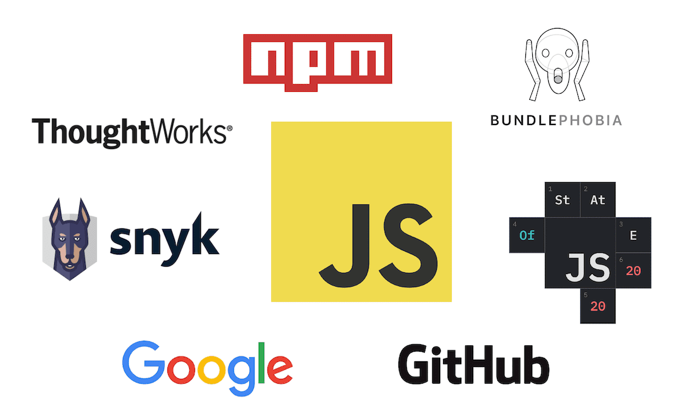
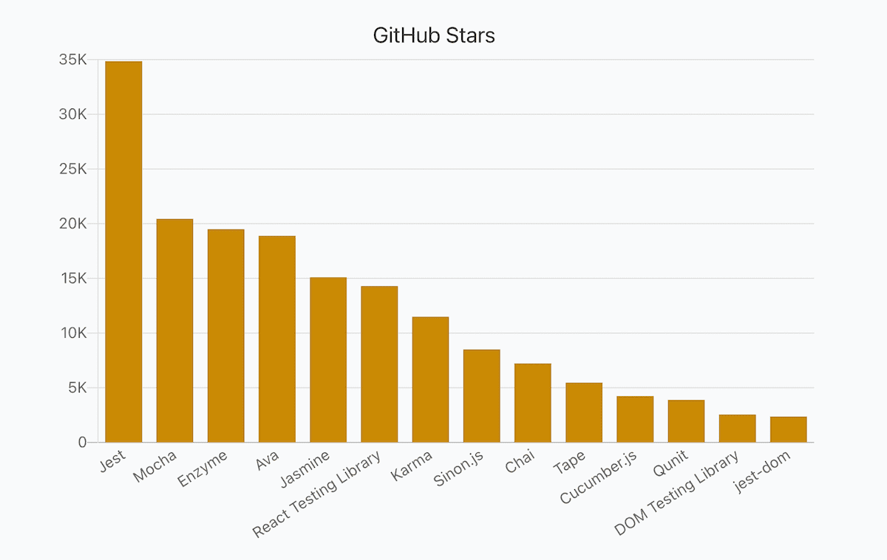
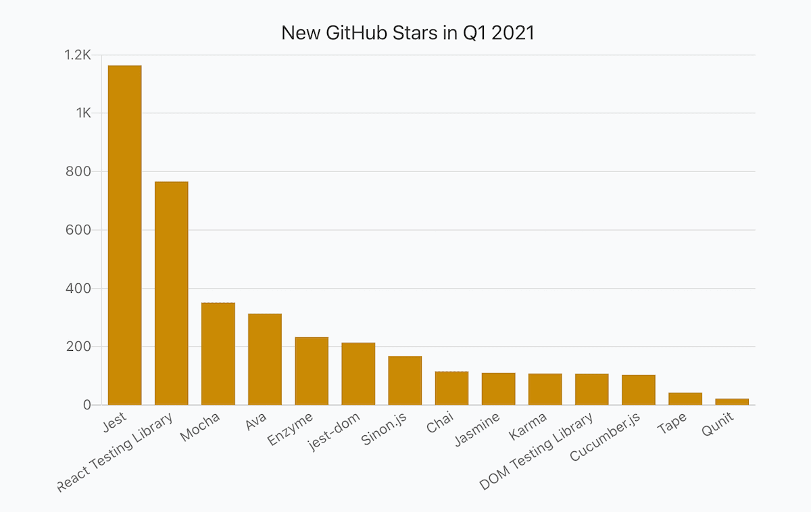
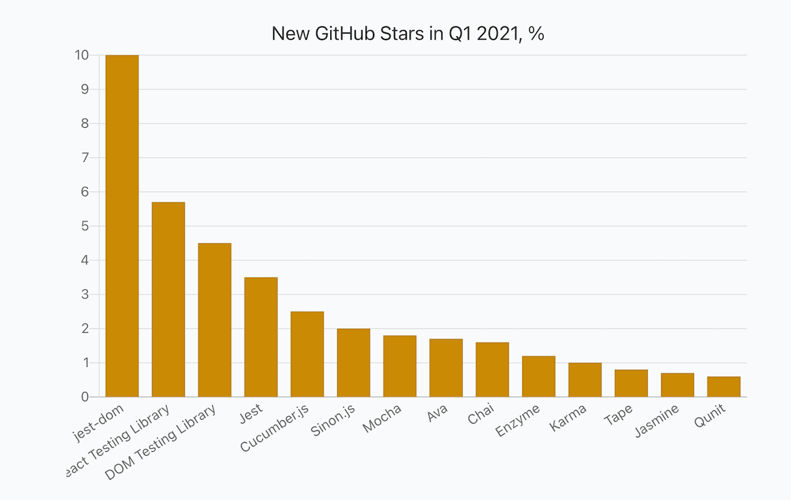
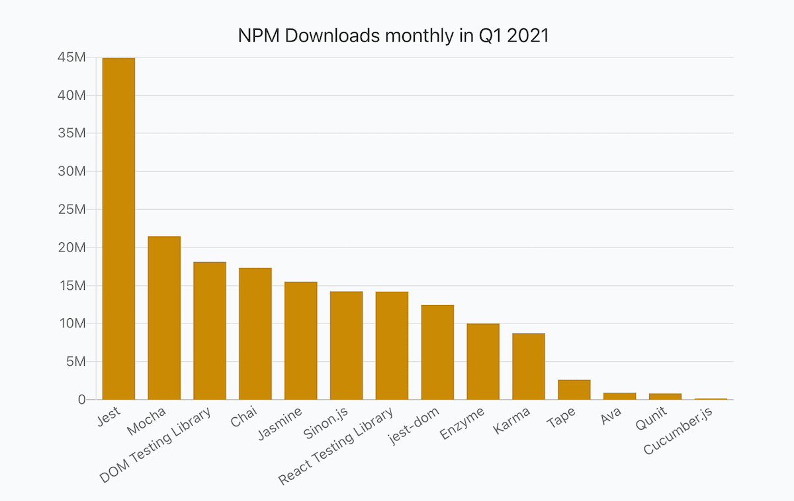
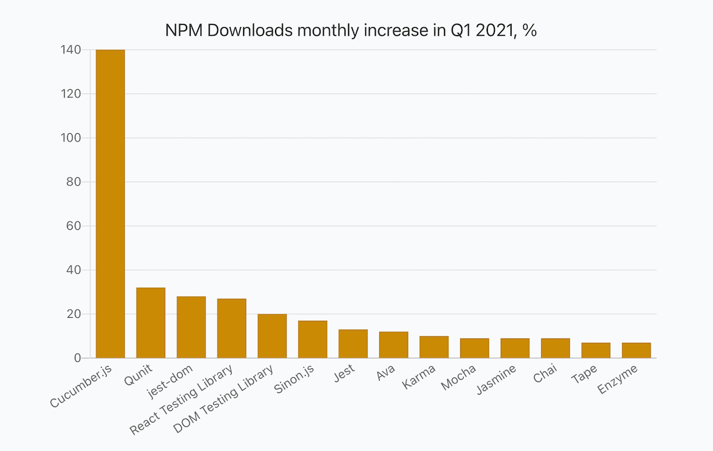
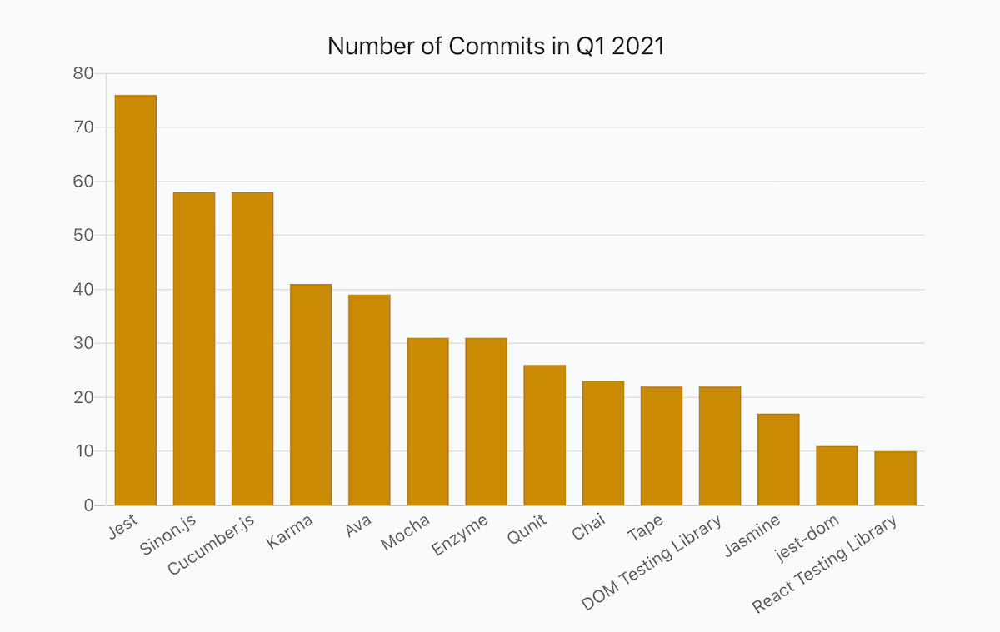
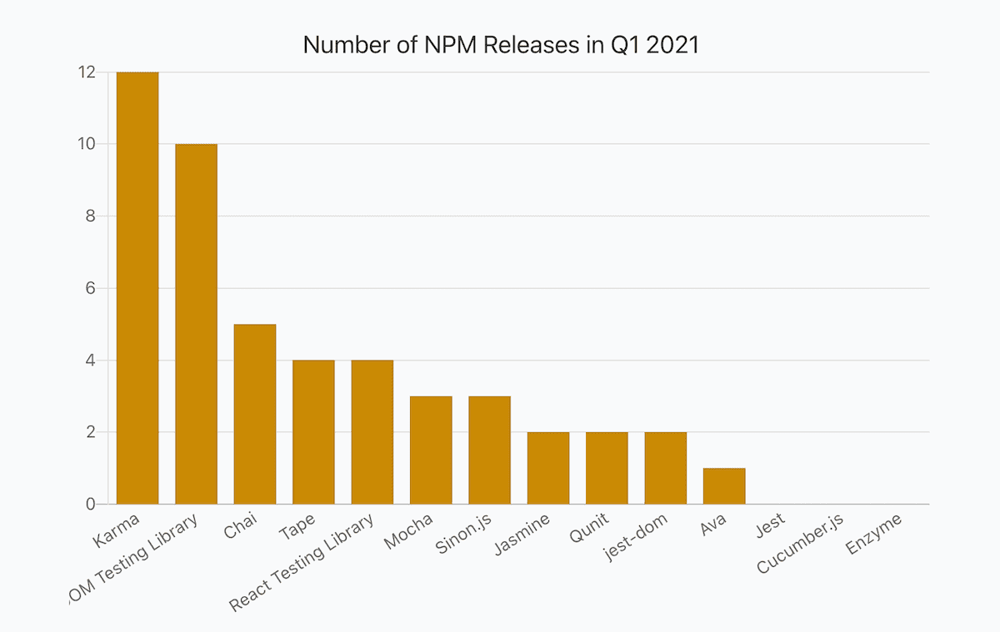
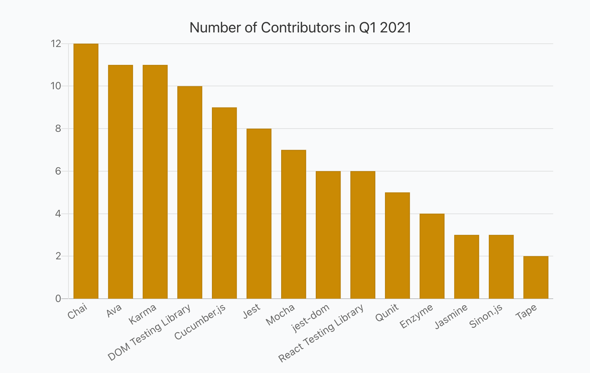

_2020-04-21 Update: Added Security information from Snyk. Made ThoughtWorks Technology Radar values clickable._

_2020-04-20 Update: I've published reports for other categories as well and recommend checking them out: [Frontend Frameworks](https://moiva.io/blog/2021-q1-state-of-js-frameworks), [State Management Libraries](https://moiva.io/blog/2021-q1-report-state-management), [Build Tools and Module Bundlers](https://moiva.io/blog/2021-q1-report-js-build-tools-bundlers), [Static Sites Generators (JAMStack)](https://moiva.io/blog/2021-q1-report-js-jamstack), and [End-to-End Testing Frameworks](https://moiva.io/blog/2021-q1-report-end-to-end-testing-frameworks)._

## Intro

This is a third report in the series "Q1 2021 State Of JavaScript Libraries and Tools".
The previous reports were dedicated to [Frontend Frameworks](https://moiva.io/blog/2021-q1-state-of-js-frameworks) and [State Management Libraries](https://moiva.io/blog/2021-q1-report-state-management).
The current report covers unit testing frameworks and libraries and provides insights into how the libraries performed in Q1 2021. Multiple data sources and metrics are used to provide a complete and unbiased picture.

I used [Moiva](http://moiva.io/) to collect all the interesting data and presented it in a table as well as in charts.

I'm going to prepare a few more similar reports dedicated to other categories - CSS Frameworks, End-to-End Testing Libraries, Node.js frameworks, Build Tools and Bundlers, and Static Site Generators. Hence, stay tuned!

## Data Sources

Data for the report came from:

- [NPM](https://www.npmjs.com/) - libraries downloads, releases, types, and dependencies.
- Google - search interest data.
- GitHub - stars, commits, contributors, license, and age.
- [State of JavaScript Survey](https://stateofjs.com/) - libraries usage amongst developers.
- [ThoughtWorks](https://www.thoughtworks.com/)'s Technology Radar data
- [Snyk](https://snyk.io/) - security information.

## Metrics

- _Stars_ - the total number of GitHub stars as of April 1, 2021.
- _New Stars_ - a number of new stars in Q1 2021.
- _New Stars, %_ - (100 \* New Stars) / (Stars - New Stars)
- _NPM Downloads monthly_ - an average monthly npm downloads number in Q1 2021.
- _NPM Downloads monthly % (incr.)_ - an increase of the average monthly npm downloads number compared to Q4 2020.
- _Search Interest, %_ - Google search interest average number compared to other libraries in the 01.10.2020-31.03.2021 period.
- _Developer Usage, %_ - percentage of developers using a library according to the latest StateOfJS 2020 survey.
- _ThoughtWorks Tech Radar_ - a "ring" where a library was put. ThoughtWorks distinguishes four rings - "_Adopt_", "_Trial_", "_Assess_", and "_Hold_". You can learn more about the Radar [here](https://www.thoughtworks.com/radar/faq).
- _NPM Releases_ - a number of NPM releases in Q1 2021.
- _Commits_ - a number of commits in Q1 2021.
- _Contributors_ - a number of contributors in Q1 2021.
- _Dependencies_ - a number of NPM packages a library has in its dependencies list.
- _Types_ - the way typings are provided, either bundled with the package (`BUNDLED`) or published to the [@types](https://www.npmjs.com/~types) organization on npm (`SEPARATE`).
- _Security_ - calculated by [Snyk](https://snyk.io/) a level of security (from `A` to `F`) of Npm packages based on the number of vulnerabilities and their severity. `A` - no vulnerabilities, `F` - the least secure level.
- _Age_
- _License_

## Awards

- [Jest](https://github.com/facebook/jest) has 35K stars in total and is a winner in the "_Total Amount Of Stars_" category.
- [Jest](https://github.com/facebook/jest) justifies the title of the most popular testing framework and gets the biggest amount of new stars in Q1 2021 - 1.2K stars. [React Testing Library](https://github.com/testing-library/react-testing-library) follows Jest with 766 new stars.
- [jest-dom](https://github.com/testing-library/jest-dom)' amount of stars increased by 10%. It was the biggest increase among the libraries in this report.
- [Jest](https://github.com/facebook/jest) is an absolute leader in the "NPM Downloads" category. It has been downloaded a hefty 45M times on average every month. [Mocha](https://github.com/mochajs/mocha) is second with 21M monthly downloads.
- [Cucumber.js](https://github.com/cucumber/cucumber-js) is a leader in terms of NPM downloads growth - 140%. Worth mentioning, that Cucumber.js had the lowest start among other libraries in the report - less than 100k monthly downloads in Q4 2020. That partly explains such impressive growth.
- [Jest](https://github.com/facebook/jest) got the biggest amount of commits in Q1 2021 - 76.
- [Chai](https://github.com/chaijs/chai) had the biggest number of contributors - 12. [Ava](https://github.com/avajs/ava) and [Karma](https://github.com/karma-runner/karma) had one contributor less.
- [Karma](https://github.com/karma-runner/karma) released the biggest number of NPM versions - 12. [DOM Testing Library](https://github.com/testing-library/dom-testing-library) follows Karma with 10 releases.

## Report

_Hint_: scroll horizontally to see values for all the libraries.

Each library has two links - Moiva and GitHub links. Use Moiva link to see more data about a particular library, to see historical data and trends.

<Table />

## Popularity: GitHub Stars

## Popularity: NPM Downloads

## Development Activity: commits, releases, and contributors

