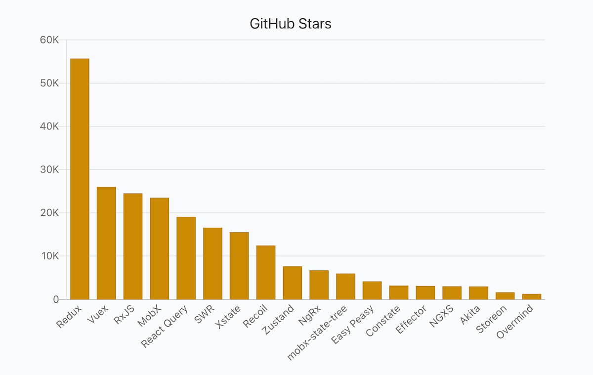
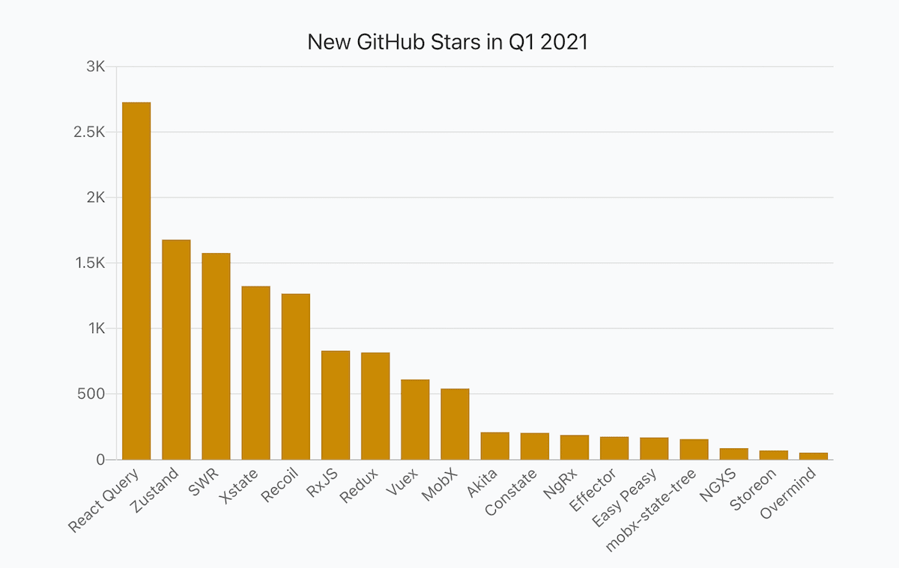
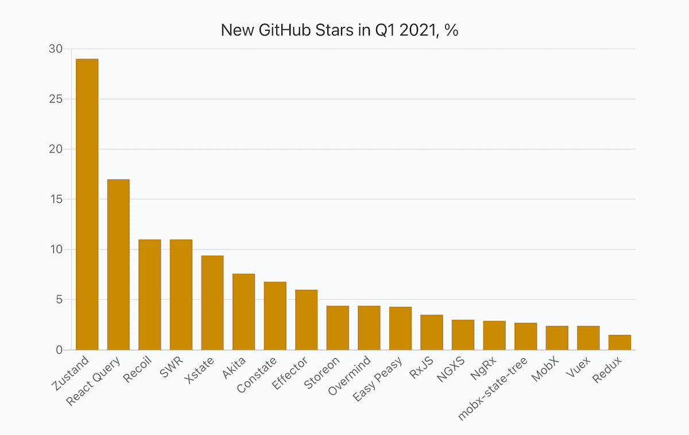
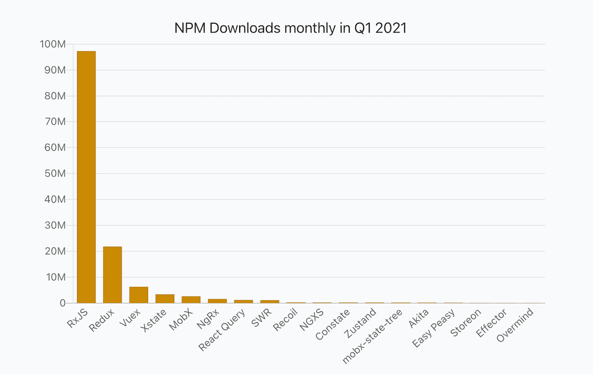
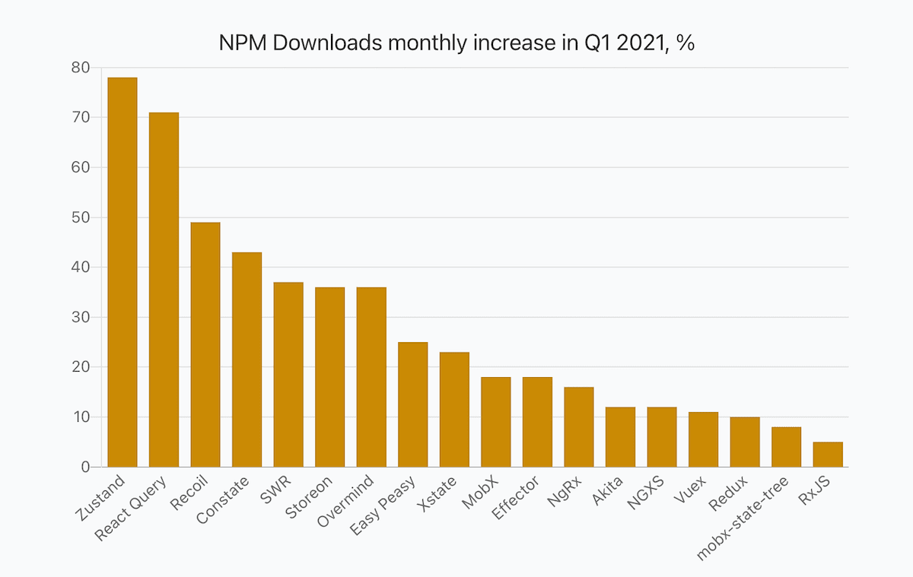
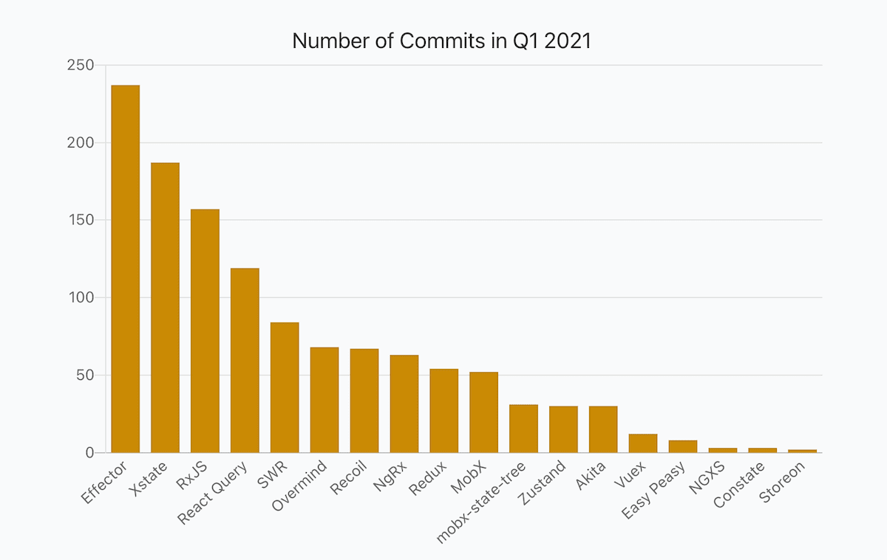
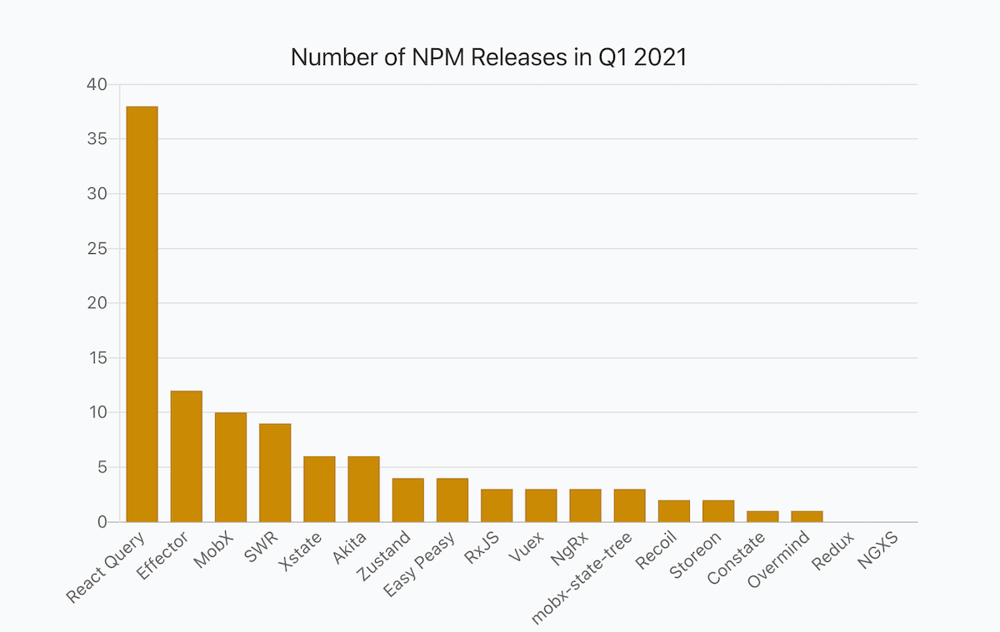
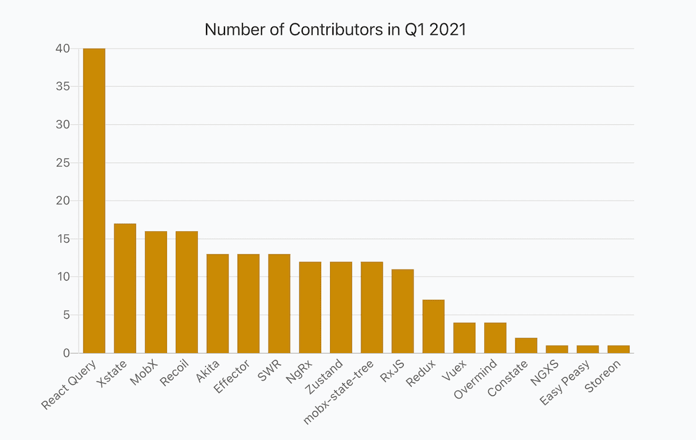

_2020-04-21 Update: Added Security information from Snyk. Made ThoughtWorks Technology Radar values clickable._

_2020-04-20 Update: I've published reports for other categories as well and recommend checking them out: [Frontend Frameworks](https://moiva.io/blog/2021-q1-state-of-js-frameworks), [Testing Frameworks](https://moiva.io/blog/2021-q1-report-js-testing-libraries), [Build Tools and Module Bundlers](https://moiva.io/blog/2021-q1-report-js-build-tools-bundlers), [Static Sites Generators (JAMStack)](https://moiva.io/blog/2021-q1-report-js-jamstack), and [End-to-End Testing Frameworks](https://moiva.io/blog/2021-q1-report-end-to-end-testing-frameworks)._

## Intro

This is a second report in the series "Q1 2021 State Of JavaScript Libraries and Tools".
The [previous report](https://moiva.io/blog/2021-q1-state-of-js-frameworks) was dedicated to UI Frameworks.
The current report covers State Management libraries and provides insights into how the libraries performed in Q1 2021. Multiple data sources and metrics are used to provide a more complete picture.

I used [Moiva](http://moiva.io/) to collect all the interesting data and presented it in a table as well as in charts.

I'm going to prepare a few more similar reports dedicated to other categories - CSS Frameworks, End-to-End Testing Libraries, Node.js frameworks, Build Tools and Bundlers, Testing Frameworks and Static Site Generators.

## Data Sources

Data for the report came from:

- [NPM](https://www.npmjs.com/) - libraries downloads, releases, types, and dependencies.
- Google - search interest data.
- GitHub - stars, commits, contributors, license, and age.
- [Bundlephobia](https://bundlephobia.com/) - bundle sizes.
- [State of JavaScript Survey](https://stateofjs.com/) - libraries usage amongst developers.
- [ThoughtWorks](https://www.thoughtworks.com/)'s Technology Radar data
- [Snyk](https://snyk.io/) - security information.

## Metrics

- _Stars_ - the total number of GitHub stars as of April 1, 2021.
- _New Stars_ - a number of new stars in Q1 2021.
- _New Stars, %_ - (100 \* New Stars) / (Stars - New Stars)
- _NPM Downloads monthly_ - an average monthly npm downloads number in Q1 2021.
- _NPM Downloads monthly % (incr.)_ - an increase of the average monthly npm downloads number compared to Q4 2020.
- _Search Interest, %_ - Google search interest average number compared to other libraries in the 01.10.2020-31.03.2021 period.
- _Developer Usage, %_ - percentage of developers using a library according to the latest StateOfJS 2020 survey.
- _ThoughtWorks Tech Radar_ - a "ring" where a library was put. ThoughtWorks distinguishes four rings - "_Adopt_", "_Trial_", "_Assess_", and "_Hold_". You can learn more about the Radar [here](https://www.thoughtworks.com/radar/faq).
- _NPM Releases_ - a number of NPM releases in Q1 2021.
- _Commits_ - a number of commits in Q1 2021.
- _Contributors_ - a number of contributors in Q1 2021.
- _Dependencies_ - a number of NPM packages a library has in its dependencies list.
- _Types_ - the way typings are provided, either bundled with the package (`BUNDLED`) or published to the [@types](https://www.npmjs.com/~types) organization on npm (`SEPARATE`).
- _Bundle Size_ - gzipped bundle size of an npm package.
- _Security_ - calculated by [Snyk](https://snyk.io/) a level of security (from `A` to `F`) of Npm packages based on the number of vulnerabilities and their severity. `A` - no vulnerabilities, `F` - the least secure level.
- _Age_
- _License_

## Awards

- [Redux](https://github.com/reduxjs/redux) with 56K stars stays unbeatable in a "_Total Amount Of Stars_" category.
- [React Query](https://github.com/tannerlinsley/react-query) got the largest amount of new stars in Q1 2021 - 2.7K. [Zustand](https://github.com/pmndrs/zustand) is second with 1.7K stars.
- [Zustand](https://github.com/pmndrs/zustand) and [React Query](https://github.com/tannerlinsley/react-query) are winners also in a "GitHub Stars Relative Growth" category. Zustand grew by 29%, React Query - by 17%.
- [RxJS](https://github.com/reactivex/rxjs) is an absolute leader in "NPM Downloads" category. It has been downloaded a hefty 97M times on average every month.
- [Zustand](https://github.com/pmndrs/zustand) and [React Query](https://github.com/tannerlinsley/react-query) grew fast not only in terms of GitHub stars, they are also leaders in NPM Downloads growth. Their downloads grew by 78% and 71% respectively.
- [Effector](https://github.com/effector/effector) got 237 commits in Q1 2021 and is a leader in "_Number of Commits_" category.
- [React Query](https://github.com/tannerlinsley/react-query) had the biggest number of contributors in Q1 2021 - 40 contributors.
- [React Query](https://github.com/tannerlinsley/react-query) made more NPM releases than any other library - 38 releases in total.

## Report

_Hint_: scroll horizontally to see values for all the libraries.

Each library has two links - Moiva and GitHub links. Use Moiva link to see more data about a particular library, to see historical data and trends.

<Table />

## Popularity: GitHub Stars

## Popularity: NPM Downloads

## Development Activity: commits, releases, and contributors

