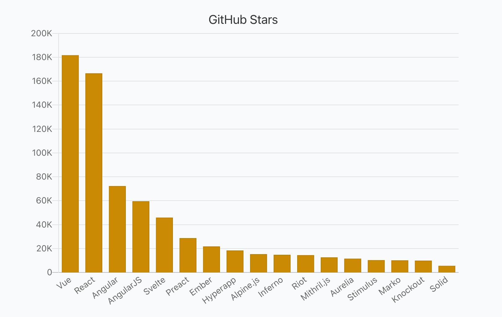
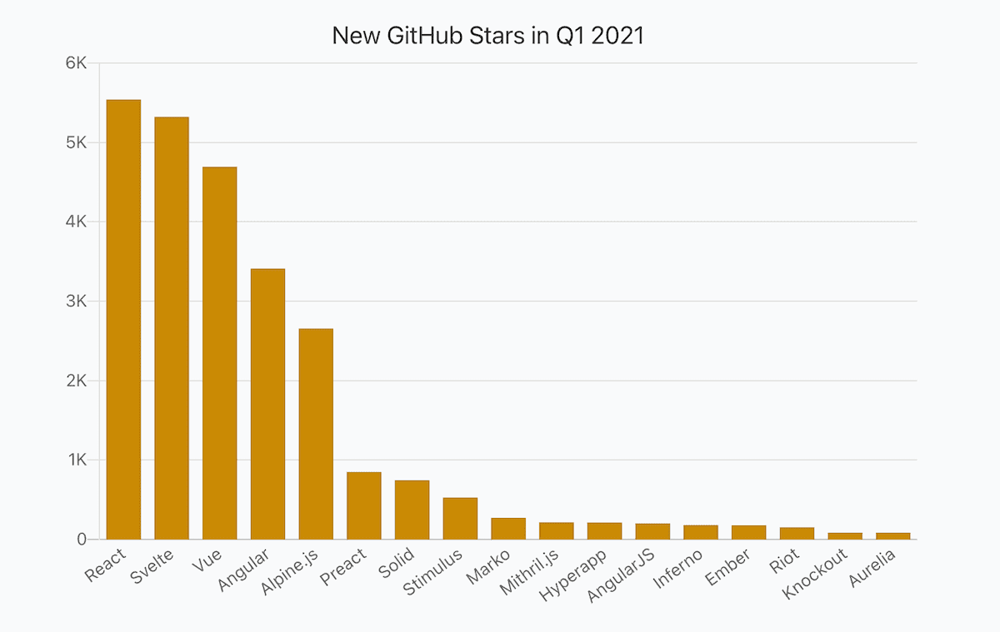
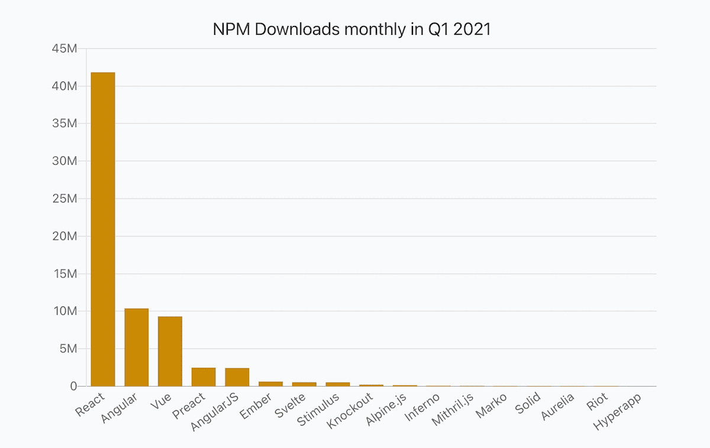
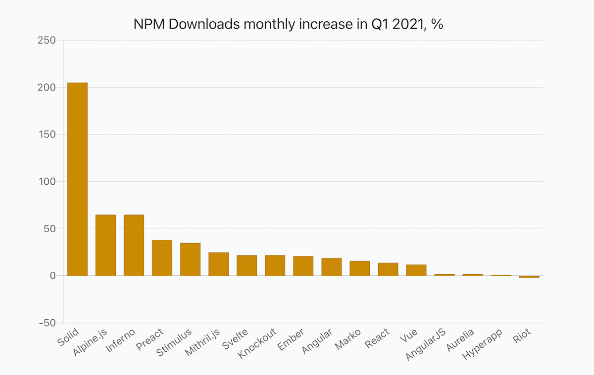
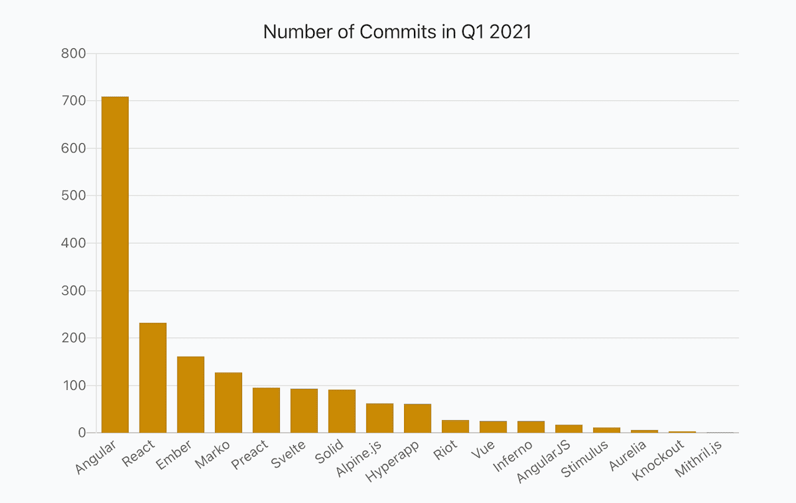
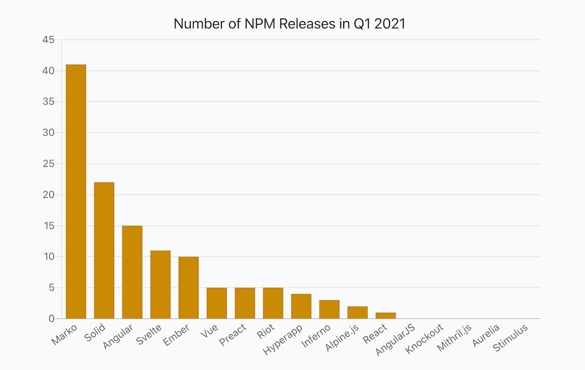
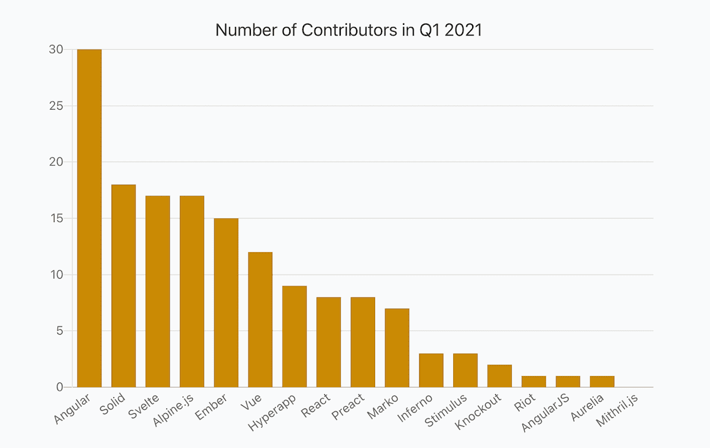

_2020-04-21 Update: Added Security information from Snyk. Made ThoughtWorks Technology Radar values clickable._

_2020-04-20 Update: I've published reports for other categories as well and recommend checking them out: [State Management Libraries](https://moiva.io/blog/2021-q1-report-state-management), [Testing Frameworks](https://moiva.io/blog/2021-q1-report-js-testing-libraries), [Build Tools and Module Bundlers](https://moiva.io/blog/2021-q1-report-js-build-tools-bundlers), [Static Sites Generators (JAMStack)](https://moiva.io/blog/2021-q1-report-js-jamstack), and [End-to-End Testing Frameworks](https://moiva.io/blog/2021-q1-report-end-to-end-testing-frameworks)._

## Intro

The first quarter of 2021 is already behind us and I thought why not to delight the public with the results of how JavaScript libraries performed in Q1 2021.

I used [Moiva](http://moiva.io/) to collect all the interesting data and presented it in a table as well as in charts.

This is the first report I have prepared and it covers JavaScript Frameworks. I'm going to prepare a few more similar reports dedicated to other categories - State Management libraries, CSS Frameworks, End-to-End Testing Libraries, Node.js frameworks, Build Tools and Bundlers, Testing Frameworks and Static Site Generators.

## Data Sources

Data for the report came from:

- [NPM](https://www.npmjs.com/) - libraries downloads, releases, types, and dependencies.
- Google - search interest data.
- GitHub - stars, commits, contributors, license, and age.
- [Bundlephobia](https://bundlephobia.com/) - bundle sizes.
- [State of JavaScript Survey](https://stateofjs.com/) - libraries usage amongst developers.
- [ThoughtWorks](https://www.thoughtworks.com/)'s Technology Radar data
- [Snyk](https://snyk.io/) - security information.

## Metrics

- _Stars_ - the total number of GitHub stars as of April 1, 2021.
- _New Stars_ - a number of new stars in Q1 2021.
- _New Stars, %_ - (100 \* New Stars) / (Stars - New Stars)
- _NPM Downloads monthly_ - an average monthly npm downloads number in Q1 2021.
- _NPM Downloads monthly % (incr.)_ - an increase of the average monthly npm downloads number compared to Q4 2020.
- _Search Interest, %_ - Google search interest average number compared to other frameworks in the 01.10.2020-31.03.2021 period.
- _Developer Usage, %_ - percentage of developers using a framework according to the latest StateOfJS 2020 survey.
- _ThoughtWorks Tech Radar_ - a "ring" where a framework was put. ThoughtWorks distinguishes four rings - "_Adopt_", "_Trial_", "_Assess_", and "_Hold_". You can learn more about the Radar [here](https://www.thoughtworks.com/radar/faq).
- _NPM Releases_ - a number of NPM releases in Q1 2021.
- _Commits_ - a number of commits in Q1 2021.
- _Contributors_ - a number of contributors in Q1 2021.
- _Dependencies_ - a number of NPM packages a framework has in its dependencies list.
- _Types_ - the way typings are provided, either bundled with the package (`BUNDLED`) or published to the [@types](https://www.npmjs.com/~types) organization on npm (`SEPARATE`).
- _Bundle Size_ - gzipped bundle size of an npm package.
- _Security_ - calculated by [Snyk](https://snyk.io/) a level of security (from `A` to `F`) of Npm packages based on the number of vulnerabilities and their severity. `A` - no vulnerabilities, `F` - the least secure level.
- _Age_
- _License_

## Awards

- [Vue](https://github.com/vuejs/vue) with 182K stars is a winner in "_Stars_" metric. [React](https://github.com/facebook/react) is lagging behind a bit with 167K stars.
- [React](https://github.com/facebook/react) is a winner in "_New Stars_" metric and got 5.5k stars in Q1 2021. [Svelte](https://github.com/sveltejs/svelte) with 5.3k stars stays close.
- [Alpine.js](https://github.com/alpinejs/alpine) got the biggest relative increase in stars - 21%.
- [React](https://github.com/facebook/react) was being downloaded 42M times on average every month. No one could compete with React here. The closest [Angular](https://github.com/angular/angular) has "only" 10M downloads.
- [Solid](https://github.com/ryansolid/solid) got 205% increase in NPM downloads and is a winner in the category. [Alpine.js](https://github.com/alpinejs/alpine) and [Inferno](https://github.com/infernojs/inferno) with 65% increase share 2nd and 3rd places.
- [Angular](https://github.com/angular/angular) is a certain leader in "_Commits_" and "_Contributors_" categories. Its repository got 709 commits from 30 contributors.
- [Marko](https://github.com/marko-js/marko) released 41 versions of its NPM package and became a winner in "_Releases_" category.

## Report

_Hint_: scroll horizontally to see values for all the frameworks.

Each frameworks has two links - Moiva and GitHub links. Use Moiva link to see more data about a particular framework, to see historical data and trends.

<Table />

\* React's bundle size includes `react-dom` package.

## Popularity: GitHub Stars

## Popularity: NPM Downloads

## Development Activity: commits, releases, and contributors

