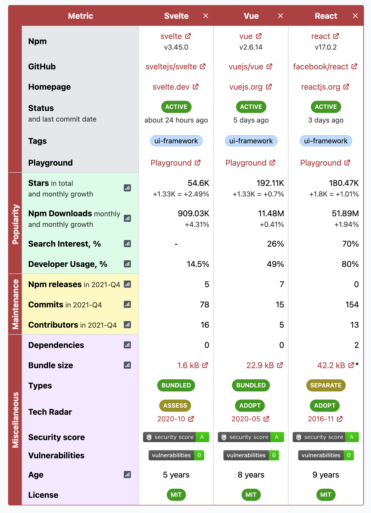
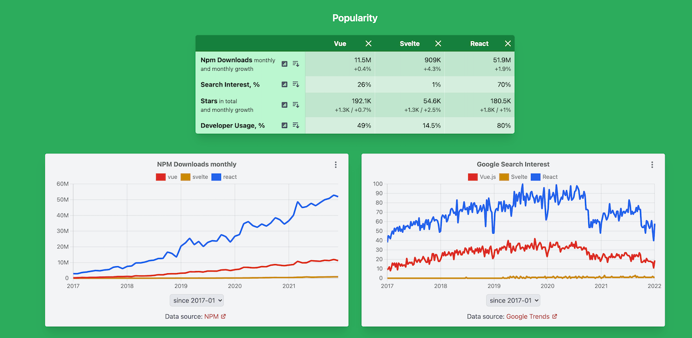
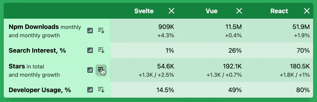

Hi everyone 👋

I wish you all a Happy New Year! 🎄🎅

This is a January report on the progress of [Moiva.io](https://moiva.io/).

## Table split into categories

Moiva collects many different metrics and presents them in a table format as well as via charts.

In the past I [organized](https://moiva.io/blog/2021-10-update/#colorised-charts-sections) all the charts by category ("Popularity", "Maintenance" and "Miscellaneous") to make it easier to digest them.

I noticed recently that the Table format also needs improvements:

- too much information is presented there at once
- it's hard to correlate information presented in Table and Charts

The following improvements were implemented:

- the table was split into categories
- tables and charts from the same category were grouped together

## Sorting by metric

When comparing numerous libraries at once, it might be handy to sort them by metrics.

I added a "Sort" button to each metric in the Table.

## Misc

Other less prominent updates:

- added multiple new libraries to Moiva's catalog
- more libraries covered in Google Search Interest chart
- improved styling
- added new metric "Description" to the Table
- updated project's dependencies
