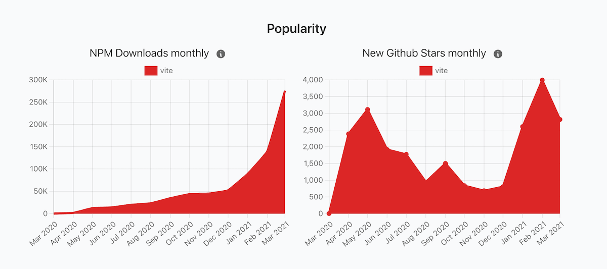
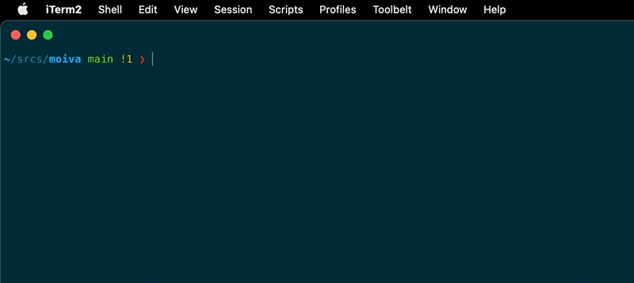
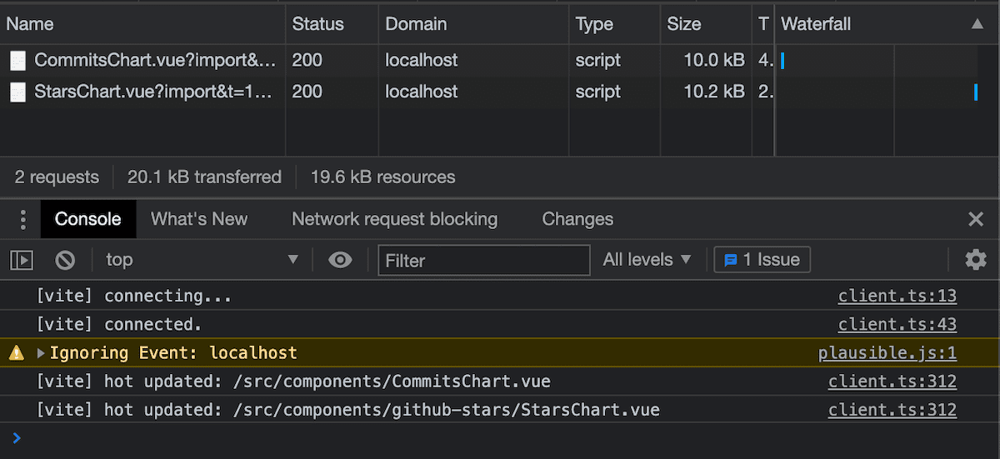
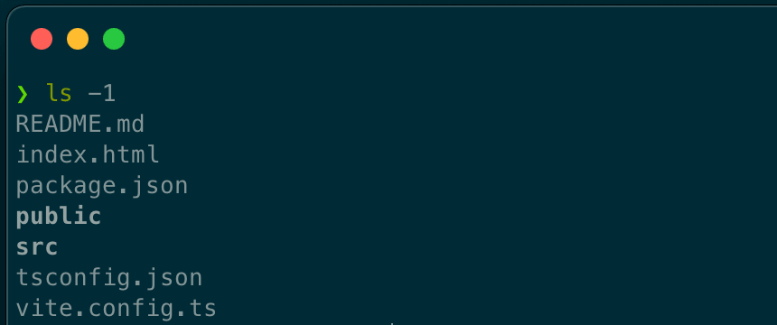

## Introduction

[Moiva.io](https://moiva.io/)'s npm dependencies had not been updated for a while and I thought the time has come.

The update didn't go well though. So I came up with a "workaroud".

<Tweet id="_aantipov/status/1385326827120599041" />

I thought it was a perfect time to try out [Vite](https://vitejs.dev/) and see if it can simplify the setup and fix the issue with dependencies conflicts.

I looked for an official guide how to do it and, surprisingly, I didn't find one. There is a [guide](https://vitejs.dev/guide/) how to bootstrap a new project with Vite, but no guidance for existing projects.

Hence I did the migration my own way and I thought it is worth sharing my approach and help others interested in migrating their apps to Vite.

The migration process might vary depending on the tech stack of your project and the way it is built. Hence you might need to adjust the steps to your needs.

My tech stack before the migration: Vue3, Vue CLI, Webpack, Babel, core-js, ESlint, Tailwind, Typescript.

Before diving into the migration steps, let's understand first what Vite is and what benefits it brings.

## What is Vite

The JavaScript landscape of build tools undergoes a significant change. We see a [rise](https://moiva.io/blog/2021-q1-report-js-build-tools-bundlers) of new tools experimenting with new approaches. Some of them quickly become popular.

One of such tools which really stands out is [Vite](https://github.com/vitejs/vite) which got 9.4K stars in Q1 2021 (that is 68% growth). Compare that number with 1.2K stars that [Webpack](https://github.com/webpack/webpack) got in the same period.



It is worth mentioning that Vite is not tied to VueJS. It is a framework-agnostic tool and there are people who already use it in their React projects.

Vite essentially does 2 things:

- provides a dev server with HMR (Hot Module Reloading)
- builds projects for production

## Benefits from migrating to Vite

Vite was created to achieve fast development feedback loop and it clearly succeeded in it:

- the dev server start time is uncomparably small
  

- code changes are reflected immediately in the browser. Only the changed components are being reloaded. There is no need to rebuild the whole application.
  

There are other substantial side benefits as well.

- Vite significantly simplifies the development setup. You can throw away Webpack, Babel, and Vue CLI with their plugins, loaders, and complex configurations.
- Smaller production builds thanks to Rollup which Vite uses under the hood.
- Faster deployments due to decreased build time.

Let's look now into how we can start using Vite.

## Step 1 - Generate a new project with Vite

In the absence of the guide, we need to start somewhere.

Vite provides a command (npm package) to bootstrap new projects. Hence I thought bootstrapping a new project and mimicking the setup would work for me.

I ran `npm init @vitejs/app` command and followed the prompts.

The resulted file structure looked clear and simple.



## Step 2 - Install required dependencies

I looked into the created `package.json` file to find out what dependencies I need to install.

<!-- {} -->

```json
{
  "name": "new-vite-project",
  "version": "0.0.0",
  "scripts": {
    "dev": "vite",
    "build": "vue-tsc --noEmit && vite build",
    "serve": "vite preview"
  },
  "dependencies": {
    "vue": "^3.0.5"
  },
  "devDependencies": {
    "@vitejs/plugin-vue": "^1.2.1",
    "@vue/compiler-sfc": "^3.0.5",
    "typescript": "^4.1.3",
    "vite": "^2.1.5",
    "vue-tsc": "^0.0.24"
  }
}
```

<!-- {} -->

That file told me that besides `vite` I need to install the following packages:

- `@vitejs/plugin-vue` to support development of VueJS based projects
- `@vue/compiler-sfc` to teach the bundler to understand VueJS single file components. You don’t need to explicitly install this package if you use NPM v7 because NPM will automatically install it as a peer dependency of `@vitejs/plugin-vue`.
- `typescript` and `vue-tsc` for types checking using a command line. You may skip these dependencies if you rely on types checking in your IDE (Vue doesn't use `typescript` to build the project).

I installed the required dependencies in my project.

## Step 3 - Add Vite configuration file

I copied the generated `vite.config.ts` to my project.

<!-- {} -->

```ts
import { defineConfig } from 'vite';
import vue from '@vitejs/plugin-vue';

// https://vitejs.dev/config/
export default defineConfig({
  plugins: [vue()],
});
```

<!-- {} -->

The only adjustment I did there was adding the `@` alias (similar to [Webpack aliases](https://webpack.js.org/configuration/resolve/#resolvealias)). I needed that change because I use `@` alias in `import` statements in my app.

<!-- {} -->

```ts
export default defineConfig({
  resolve: { alias: { '@': '/src' } },
  plugins: [vue()],
});
```

<!-- {} -->

## Step 4 - Move index.html to the root folder

Vite [treats](https://vitejs.dev/guide/#index-html-and-project-root) `index.html` as the entry point to your application and it should be put in the root folder.

Hence I moved my `index.html` from `/public` to `/` folder.

The only change to the `index.html` I made was specifying a link to the entry point of my code:

<!-- {} -->

```html
  <script type="module" src="/src/main.ts"></script>
</body>
```

<!-- {} -->

## Step 5 - Adjust tailwind.config.ts

Migration to Vite broke the styling of my application. It worked perfectly fine in the development environment, but the styling was partly broken in production builds.

I figured out soon that it was caused by the location change of the `index.html` file - Tailwind stopped considering that file while collecting the classes in use. Hence style definitions for classes from that file were not included in the production build.

The problem was fixed easily by tweaking the `tailwind.config.js` file and specifying the correct path to the `index.html` file.

<!-- {} -->

```js
module.exports = {
  purge: {
    content: ['./index.html', './src/**/*.vue'],
  },
  theme: {...},
  variants: {},
  plugins: [],
};

```

<!-- {} -->

## Step 6 - Adjust tsconfig.ts

I looked into the generated `tsconfig.json` file

<!-- {} -->

```json
{
  "compilerOptions": {
    "target": "esnext",
    "module": "esnext",
    "moduleResolution": "node",
    "strict": true,
    "jsx": "preserve",
    "sourceMap": true,
    "resolveJsonModule": true,
    "esModuleInterop": true,
    "lib": ["esnext", "dom"],
    "types": ["vite/client"]
  },
  "include": ["src/**/*.ts", "src/**/*.d.ts", "src/**/*.tsx", "src/**/*.vue"]
}
```

<!-- {} -->

and adjusted my `tsconfig.json` file accordingly.

## Step 7 - Adjust npm tasks

I used the generated `package.json` to adjust my npm tasks to build, preview and start the server:

```json
"scripts": {
  "dev": "vite",
  "build": "vue-tsc --noEmit && vite build",
  "serve": "vite preview"
}
```

`build` task includes `vue-tsc --moEmit` command to type check the code.

I also had to adjust the `lint` task and run `eslint` directly instead of relying on Vue CLI: `"lint": "vue-cli-service lint"` became `"lint": "eslint --ext .ts,.js,.vue"`.

Having done that, I accomplished "feature parity" with the previous setup - the app could be developed, built and deployed.

I just needed to do one small but important thing.

## Final Step - Cleanup

We are almost there. The only thing left is to remove the dependencies which are no longer needed.

I removed Vue CLI and its plugins, and core-js. The result was impressive: `package-lock.json` file became lighter by ~35k lines.


I also removed `babel.config.js` and `vue.config.js` files, they became obsolete.

## Conclusion

At first, I didn't believe in the success of the endeavor.

Vite is still a very young project (1-year-old) and to replace such a huge chunk of the development setup (Webpack and Babel with their plugins/loaders) seemed to be impossible to achieve.

Turned out the migration went very easy, almost seamless.

As a result, I got huge improvements in the development process, fewer dependencies to care about, decreased deployment time (from 2 min to 1 min), and slightly smaller production bundles.

[Evan You](https://twitter.com/youyuxi), the author of Vite and VueJS, did amazing work there. I can't stop being impressed by what he is doing. Always mind-blowing!
