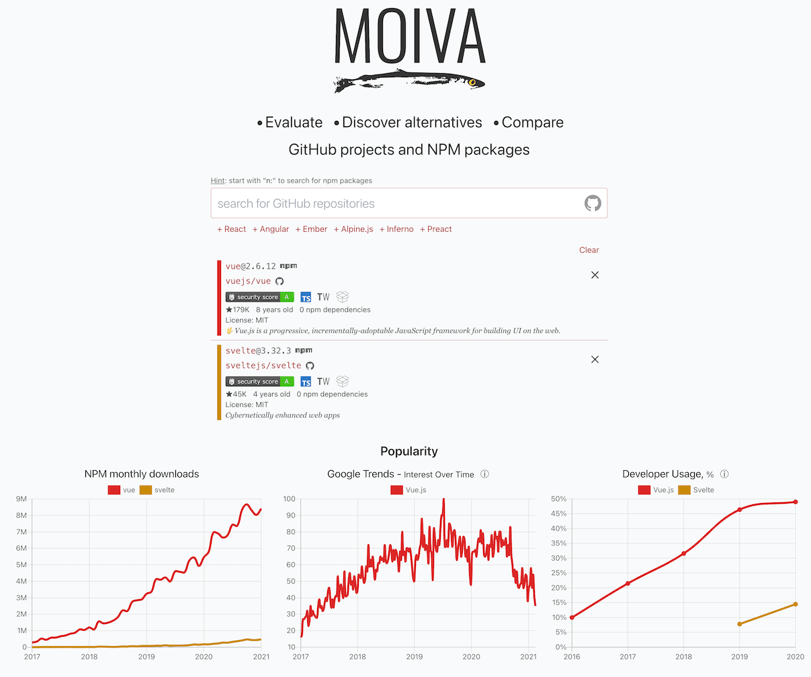
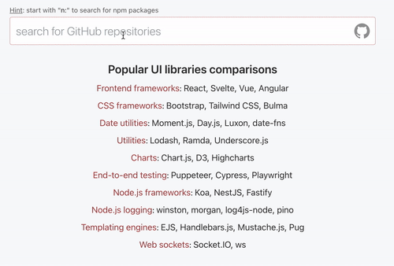

Hi, Alexey is here. I have some exciting news for you!

I rewrote [Moiva.io](https://moiva.io/) from scratch and made it a Universal and Flexible tool to suit a taste of every software developer be they a JavaScript, Python or [put your favorite language here] developer.

This article marks a third major release of Moiva.

## What's new (in short)

- ability to search for and get data for any GitHub repository in addition to search and comparison of NPM packages.
- possibility to bring (relatively easy) Search, Suggestion, and Comparison capabilities to other programming languages' package management systems like [Maven](https://mvnrepository.com/) (Java), [PIP](https://pypi.org/) (Python), or [Packagist](https://packagist.org/) (PHP).
- last but not least, Moiva got [open-sourced](https://github.com/aantipov/moiva).

## Why I did it

At first, I wanted to focus on JavaScript ecosystem, making npm packages first-class citizens in Moiva.io.

The goal was to provide developers with a good tool to evaluate and compare npm packages in different dimensions - Popularity, Maintenance, Security, etc.

But very soon I realized that there are many JavaScript-related projects which don't have any published npm packages.

Think of, for example, frameworks like `Meteor`.

Moiva.io could potentially be useful for the evaluation of those projects as well thanks to GitHub charts (Contributors, Issues, Commits Frequency, etc.), but search functionality was limited to npm packages only and everything was built around the concept of npm packages.

On the other hand, if Moiva gets opened up to the search, evaluation and comparison of **any** GitHub project, it will essentially convert Moiva into a universal tool and make it useful to many more developers.

So I got convinced that Moiva should become more Universal and Agile, I just need to come up with a good harmonious concept of how it should look, work and how to implement it.

## AHA moment

In the beginning, the idea of supporting GitHub looked vague and blurred. I didn't have any good idea how to put together existing functionality for npm packages and the new one for GitHub repositories.

I could implement separate pages for npm and GitHub, but that was not ideal. Both have a lot in common when comparing JavaScript projects.

Then the `AHA` moment came - everything became clear, I realized how to put together different things and since then I was unstoppable.

Here is the essence of the solution.

### One Search for All

The same single search field can be used to search for both npm packages and GitHub repositories. It can be easily achieved via search modifiers (prefixes).

The default search is for GitHub.

The search prefixed with `n:` is for npm packages.

What I like about that solution is that it can be easily extended in the future to search for other things as well.

### Show only relevant charts

If a user selects only GitHub repositories without related npm packages, then we can just hide npm-related charts. No reason to show them.

It's similar to how ThoughtWorks TechRadar and Developer Usage charts work - they are shown only when there is data for the selected npm packages.

At the same time, if the user selects a mix of npm and Github projects, we will show npm-related charts for the selected npm packages.

### How about URLs

Every comparison a user makes in Moiva should be easily reproducible via URL.

It means that Moiva should be able to derive from the URL what information to load, what to put into comparison.

When npm packages were the only citizens in the Moiva world, the task was solved easily - the selected npm packages' names were listed in a query parameter: `https://moiva.io/?compare=react+svelte+vue`.

Having 2 types of citizens, npm and Github, where one depends on the other, complicates things a bit. Moreover, we want to build a future-proof solution that can incorporate other types of citizens like PIP and Maven.

GitHub has a broader scope than npm and my first idea was to replace URL npm identifiers with GitHub identifiers. But there are 2 problems with it:

- it's not clear how to derive the npm package from the GitHub repository. At least I couldn't find the solution for that.
- one GitHub repo can be a source of multiple npm packages. There is no 1:1 connection.

It lead me to the conclusion that GitHub and npm should be referenced separately in the URL.

So I just decided to have separate query parameters: `https://moiva.io/?npm=svelte+vue&github=meteor/meteor`.

### GitHub and NPM reconciliation

Imagine two situations:

1. a user selects Vue as an npm package.
2. a user selects Vue as a GitHub repo.

In the first situation Moiva shows npm-related data and charts like npm Downloads. In the second situation, it doesn't.

But is it fair? Most probably a user would expect to see the same set of information in both cases, right?

Could we still somehow derive information about the npm package from the GitHub repository? If yes, then we could show npm data for the selected GitHub repository.

Turns out we can make use of [Moiva Catalog](https://github.com/aantipov/moiva-catalog) which was built to implement the Suggestions mechanism.
For every listed GitHub repository we can add a name of the npm package if there is one. It means we can solve the problem of the reconciliation for items listed in the catalog. And I think it's a good enough solution with which we can cover the most popular libraries.

We just need to take care of some details and edge cases.

1. If a repository does have an npm package, but that package is just one of the repo's "by-products", then probably it doesn't make sense to show that npm package data when selecting the repository. To solve that problem, an additional flag `isNpmCoreArtifact` in the catalog can be used to indicate the "role" of the npm package.
2. If we successfully derive npm data from the GitHub repository, it means we essentially display the same information for both npm and GitHub and have different URL identifiers for the same page. It's not good, especially in terms of SEO. So I decided to use npm package's name as a URL identifier in such cases. Try load `https://moiva.io/?github=vuejs/vue` url and see what happens ;=)

### Data model

I mentioned just a few of the problems I had to solve. There were, of course, many others, like duplication handling, aliases, SEO, etc.

Most of the problems got a straightforward solution once I implemented a proper Data Model - I came up with a new abstraction called "Library" and provided it with certain properties and behavior.

If you are interested, you can check the [repository's readme](https://github.com/aantipov/moiva/) for more details about the Library concept.

## What's next

I clearly see a huge potential for [Moiva.io](https://moiva.io/) to become a really useful tool to many developers.

It can grow and become better in different directions.
I will mention a few of them which look most important to me:

- enable search/suggestion/comparison for more languages' package systems (Maven, PIP, etc.).
- add more useful charts and data, both generic and language/package-system specific.
- improve significantly the alternatives suggestion system. Currently, it's based on [Moiva Catalog](https://github.com/aantipov/moiva-catalog) and needs a lot of data to be put there. I see a way how the community could help and contribute there.
