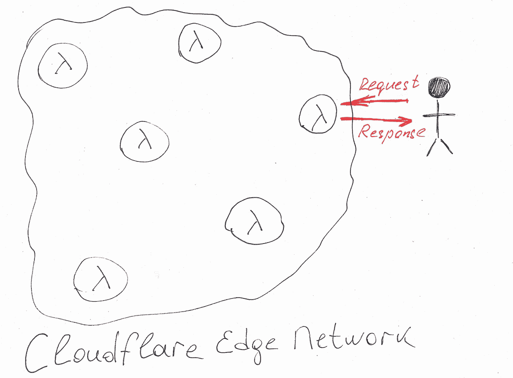
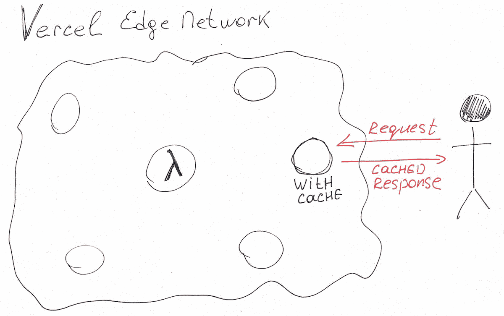
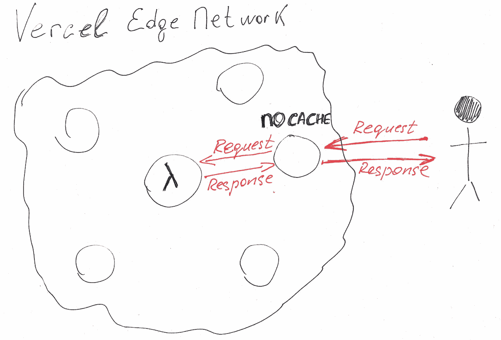
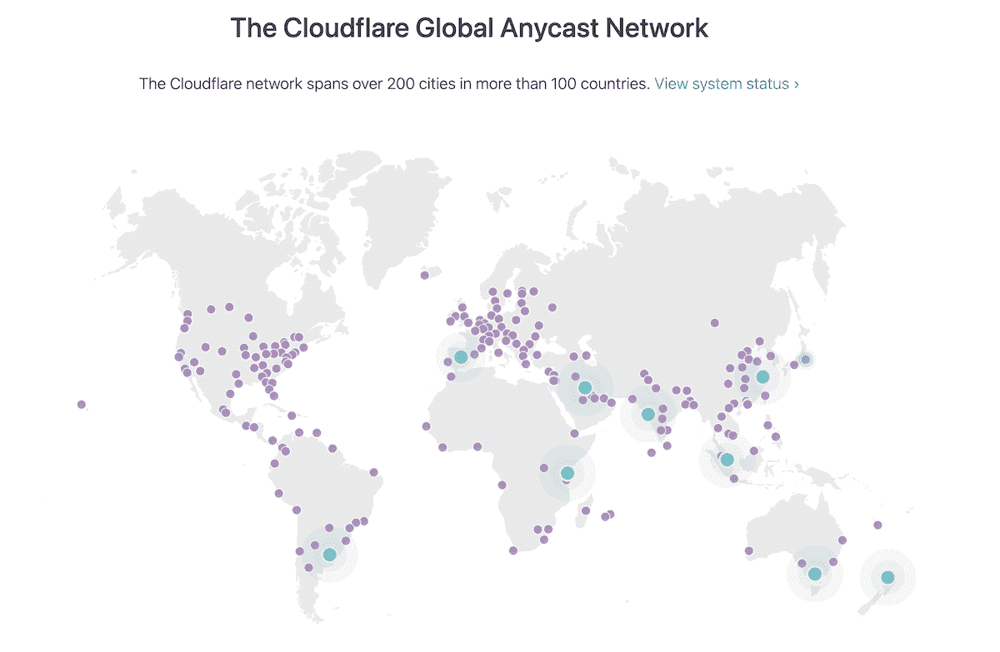
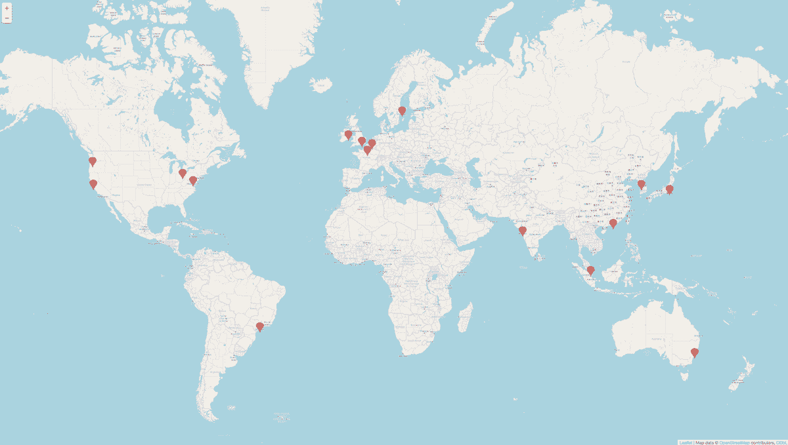
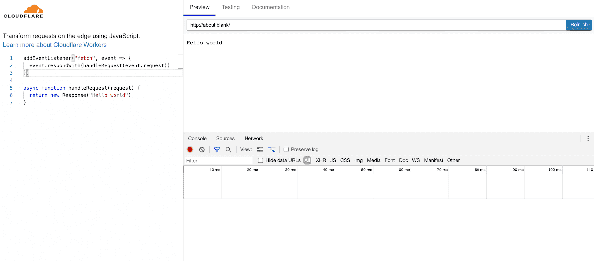

::: info Update 2021-05-11
Cloudflare released [Workers Unboud](https://blog.cloudflare.com/workers-unbound-ga/) - a solution for serverless functions that need long excecution times. It extends the existing 50ms CPU limit to 30sec and changes their billing scheme.
:::

::: info Update 2021-03-29
Added an image of vercel edge network map. kudos to [@magnemg](https://twitter.com/magnemg) for creating it.
:::

## TLDR

Vercel provides a good solid solution for Serverless Functions and makes the process of their creation seamless and hassle-free.
Cloudflare Workers offer more functionality out-of-the-box (e.g. key-value data store, CRON) and look more mature and sophisticated.

## Before we proceed

All my conclusions and findings are based on the official documentation provided by Vercel and Cloudflare and also based on my experience with both platforms.
I reserve the right for mistakes. Please let me know if you find any.

## Introduction

I've been using [Vercel](https://vercel.com/) since the start of [Moiva](http://moiva.io) development. It helped to bootstrap and develop Moiva fast. I'm very grateful to the developers at Vercel, they do a great job there.

[Vercel](https://vercel.com/), in the essence, is a solution for automatic deployments of static websites to a network of data-centers around the world. Vercel doesn't stop there and provides a solution for Serverless Functions which works really great and smooth.

With further development of Moiva I accumulated a set of requirements for Serverless Functions which Vercel, unfortunately, didn't meet. Hence I looked around and found [Cloudflare Workers](https://workers.cloudflare.com/).
I gave it a try and I liked it. Two weeks later all my Serverless Functions were migrated there.

[Cloudflare Workers](https://workers.cloudflare.com/) is basically a platform for deployment of Serverless Functions to a network of data-centers around the world. Their documentation [says](https://developers.cloudflare.com/workers/platform/sites) that Workers can also be used to deploy static applications as well, but I haven't looked into it or evaluated it. I know that Cloudflare is also working on another solution for deployment/hosting of static applications - [Cloudflare Pages](https://pages.cloudflare.com/).

I thought that my findings could be interested to others. Here we go!

## Serverless Functions requests handling

The high-level picture of how Serverless Functions requests are handled is different in Vercel and Cloudflare Workers. I think it makes sense to start the comparison with an explanation of how each platform works and highlighting the differences.

First of all, both platforms use a so-called Edge Network of thousands of servers distributed across the globe.

In **Cloudflare Workers** every Function during deployment gets replicated in every data center. Every request is load-balanced and routed to the nearest data center, which executes the Function and sends the response back to the user.



It's important to note here that Functions are executed on **every** request, even if the response has been cached. The cache works on a deeper more granular level:

- Function's outgoing sub-requests are cached automatically.
- developers can utilize Cloudflare's [Cache API](https://developers.cloudflare.com/workers/runtime-apis/cache) to cache the response and use it in further requests. It can be especially handy in case of heavy computations.

**Vercel** doesn't replicate Functions across their Network in Free and Pro accounts - Functions can be deployed to one particular region only. Enterprise plan users can specify multiple regions for Serverless Functions.

Similar to Cloudflare, every request is being routed to the nearest data center. Here similarities end and the following steps are being processed:

1. If the data center has a cache for the request, then the cached response is sent back to the user immediately. The Function is not executed. The request processing is finished.
   
2. If the data center doesn't have the Function aboard, then it finds the nearest data center which has it and forwards the request there.
3. The Function is executed and the response is sent back to the original server.
4. The original server caches the response (according to headers specified by the developer) and sends the response back to the user.
   

## Requests Travel Time

Speed is an important characteristic of Serverless Functions. It is measured by the time it takes to deliver the response to the user.

One of its constituents is Travel Time. The less time the request spends traveling the better.

**Cloudflare Workers**, as we saw above, route every request to the nearest data center which processes it and sends the response back. Cloudflare [says](https://www.cloudflare.com/network/) its Network spans over 200 cities in more than 100 countries. That guarantees the least Travel Time.



**Vercel**'s Network is significantly less dense and spans [less than 20 locations](https://vercel.com/docs/edge-network/regions). It means that on average requests will spend more time traveling.
Moreover, requests will end on the nearest server only in the happy case of a pre-existing cache. Other times, as we saw above, the request will be forwarded further to the data center which contains the Function. It diminishes all advantages of having a global network of data centers.



## Function Execution time

Request/Function Execution Time is another major constituent of Speed.
It largely depends on if there is cached data already or not.

As was already mentioned, Cache handling in Vercel and Cloudflare is done differently.

Cloudflare Worker always executes the Function whether or not there is cached data. Vercel, on the other hand, never executes the Function if it has valid cached data.
We can imagine it affects Execution Time, but not significantly because Cloudflare limits it (see Limits section below for details).

In the absence of cached data, Execution Time depends on how fast the runtime environment is bootstrapped and on the available runtime resources like memory and CPU and if the Function is "HOT" or "COLD" (applies to Vercel only).

**Cloudflare** uses Google's [V8 Engine](https://v8.dev/) under the hood and executes Functions in the context of V8 Isolates. Cloudflare [claims](https://developers.cloudflare.com/workers/learning/how-workers-works#isolates) that its approach is much more efficient than other Functions implementations and eliminates the cold starts of the virtual machine model:

> Workers processes are able to run essentially limitless scripts with almost no individual overhead by creating an isolate for each Workers function call. Any given isolate can start around a hundred times faster than a Node process on a container or virtual machine. Notably, on startup isolates consume an order of magnitude less memory.

**Vercel** uses Cloud Providers Amazon and Google to execute Functions and natively supports NodeJS, Go, Python, and Ruby environments. Hot/Cold boots apply here:

- If a subsequent request happens quickly thereafter, the function is re-used for a new invocation (Hot Boot)
- Otherwise, the Function boots up from scratch (Cold Boot)

Vercel [says](https://vercel.com/docs/serverless-functions/conceptual-model#cold-and-hot-boots) that their configuration provides "nearly instant" cold boots:

> Cloud providers allow for a variety of different sized functions, but we have picked one that is aligned with making cold boot instantiation nearly instant for user-facing workloads (such as serving HTTP traffic)

## DX and Ease of development/deployment

If you are using Vercel to deploy your website, then adding a new Serverless Function is as easy as adding a new NodeJS Express-like script (or written in a different language script) under `/api` folder.
Vercel Serverless functions also work in the local dev environment out-of-the-box.
Vercel achieves great Developer Experience (DX) here.

If you use Vercel for website deployment, but want to use Cloudflare Workers for Serverless (like me), then you need to learn and deal with many more things:

- how to write the script and what API is available
- how Cache works and should you customize it or automatic settings are enough
- how to set up automatic deployments from a repository
- how to organize Functions in the repository
- should you use and set up a custom domain or the one provided by Cloudflare is enough

Cloudflare provides really great documentation with many easy-to-follow examples and "Starters" (GitHub repositories) for different use cases.
It also provides a [Playground](https://developers.cloudflare.com/workers/learning/playground) to preview, debug and develop your functions. I find it very helpful and use it frequently.



## Cache management

Cache in Vercel and Cloudflare Workers is always local to the Region (Data Center).

**Vercel's** cache configuration is limited to setting a `Cache-Control` header on the response of the Function. Vercel recommends here not to use Browser caching, but rely on Vercel's Network cache. Hence configuration comes down mostly to setting the cache time. Moreover, there is a bunch of restrictions regarding when the cache can be used (e.g. response status codes and request methods, request headers).

When providing a cached response, Vercel doesn't give a chance to the Function to execute and do any changes to the cached response or, for example, log the request.

With every new deployment Vercel automatically invalidates the Cache. Hence, if there is a need to invalidate the cache, developers need to redeploy their application.

**Cloudflare** provides a much more flexible and granular cache configuration and has a different mental model about how caching should work.

Most of the time Functions don't have heavy computations, they spend their time mostly awaiting the responses from subrequests.

Recognizing that, Cloudflare runs Functions on every request and provides automatic caching for outbound Function subrequests. Developers can modify subrequests caching behavior by providing [certain configuration](https://developers.cloudflare.com/workers/runtime-apis/request#requestinitcfproperties).

I think that running a Function every time on every request is a very important feature that distinguishes Cloudflare Workers from Vercel. It allows you to log stuff to third-party services and have some analytics.

Cloudflare covers also the case when a Function does have heavy computations. Developers have access to Cache API to store Function responses and use it in future requests. Developers are free to define how and when to cache, whet to use and when to delete the cached value, free to modify the cached value before sending the response. Cloudflare provides good documentation and [examples](https://developers.cloudflare.com/workers/examples) to start from.

```javascript
async function handleRequest(event) {
  const request = event.request;
  const cacheUrl = new URL(request.url);

  // Construct the cache key from the cache URL
  const cacheKey = new Request(cacheUrl.toString(), request);
  const cache = caches.default;

  // Check whether the value is already available in the cache
  // if not, you will need to fetch it from origin, and store it in the cache
  // for future access
  let response = await cache.match(cacheKey);

  if (!response) {
    // If not in cache, get it from origin
    response = await fetch(request);

    // Must use Response constructor to inherit all of response's fields
    response = new Response(response.body, response);

    // Cache API respects Cache-Control headers. Setting s-max-age to 10
    // will limit the response to be in cache for 10 seconds max

    // Any changes made to the response here will be reflected in the cached value
    response.headers.append('Cache-Control', 's-maxage=10');

    // Store the fetched response as cacheKey
    // Use waitUntil so you can return the response without blocking on
    // writing to cache
    event.waitUntil(cache.put(cacheKey, response.clone()));
  }
  return response;
}
```

<div class="code-descr">Code snippet taken from <a href="https://developers.cloudflare.com/workers/examples/cache-api">https://developers.cloudflare.com/workers/examples/cache-api</a> </div>

## Key-value Data Store

Cloudflare Serverless Functions have a really nice distinct feature - they have access to a global, low-latency, key-value [data store](https://developers.cloudflare.com/workers/learning/how-kv-works). Changes to that store are propagated to all other edge locations and become globally visible. That store doesn't replace a database but works nicely in some cases. I think of it as a globally available Cache. That store can also be prepopulated manually (via CLI interface) or during deployment. Developers can define a lifetime for values there to make sure they are automatically discarded at a certain moment.

## Programming Languages

**Cloudflare** supports only one runtime - Chrome's [V8](https://v8.dev/). Hence, it supports natively JavaScript. For many languages like Kotlin, PHP, Python it's possible to compile programs to JavaScript. So developers can write Functions in those languages as well, they just need to have a compilation to JavaScript step.

Cloudflare doesn't stop there and provides [support for Web Assembly](https://blog.cloudflare.com/webassembly-on-cloudflare-workers/) as well. It means that also compiled languages like C, C++, Rust, and Go can be used to write Functions.

**Vercel** [officially supports](https://vercel.com/docs/runtimes?query=runtime#official-runtimes) 4 different language runtimes - NodeJS, Go, Python and Ruby.

Vercel also allows creating custom runtimes with different languages. There are some community runtimes available that have official Vercel's [recommendation](https://vercel.com/docs/runtimes?query=runtime#advanced-usage/community-runtimes): Bash, Deno, PHP, and Rust.

## Scheduled Invocations (Cron)

**Cloudflare** has [built-in support](https://developers.cloudflare.com/workers/platform/cron-triggers) for scheduled invocations of Functions.

**Vercel** doesn't have built-in support for scheduled tasks and [recommends](https://vercel.com/docs/solutions/cron-jobs) using third-party services.

## Logging to 3rd party services

There is often a need to communicate to 3rd party services in a non-blocking way - you send a Response to the user and, in parallel, send data to some 3rd party services, for example, gather some statistical data.

The problem with Serverless Functions is that their lifetime is very limited and it might happen that the runtime shuts down before it handles the communication.

**Cloudflare** provides a [`waitUntil()`](https://developers.cloudflare.com/workers/learning/fetch-event-lifecycle#waituntil) hook to notify the runtime to wait for tasks that run longer than the time it takes to send the response. It is used, for example, to write data to Cache.

```javascript
if (!response) {
  // If not in cache, get it from origin
  response = await fetch(request);

  // Must use Response constructor to inherit all of response's fields
  response = new Response(response.body, response);

  // Cache API respects Cache-Control headers. Setting s-max-age to 10
  // will limit the response to be in cache for 10 seconds max

  // Any changes made to the response here will be reflected in the cached value
  response.headers.append('Cache-Control', 's-maxage=10');

  // Store the fetched response as cacheKey
  // Use waitUntil so you can return the response without blocking on
  // writing to cache
  event.waitUntil(cache.put(cacheKey, response.clone()));
}
return response;
```

<div class="code-descr">Code snippet taken from <a href="https://developers.cloudflare.com/workers/examples/cache-api">https://developers.cloudflare.com/workers/examples/cache-api</a> </div>

In **Vercel**'s Functions, I tried to set up logging errors to Sentry and logging data to some database, but it worked unpredictably - sometimes it worked, sometimes it didn't. I also got strange errors in logs. It took me time to realize that the problem was that the runtime stops working once the Response is sent.

> It is important to note that Serverless Functions, even while the underlying container is hot, cannot leave tasks running. If a sub-process is running by the time the response is returned, the entire container is frozen. When a new invocation happens, if the container is re-used, it is unfrozen, which allows sub-processes to continue running.

I couldn't find any workaround for such a problem.

Another problem that I found with Vercel is that you can't really log all the requests to your Function and build analytics on top of it because Functions are not executed in case there is a cached response for the request. I couldn't find a solution for it. There is no such problem with Cloudflare because its Functions get always executed on every request.

## Limits

::: info Update 2021-05-11
The recently released Cloudflare's [Workers Unboud](https://blog.cloudflare.com/workers-unbound-ga/) solution extends the 50ms CPU limit to 30sec. You can find more information on the Cloudflare [Limits](https://developers.cloudflare.com/workers/platform/limits#worker-limits) page.
:::

|                     | Cloudflare [(link)](https://developers.cloudflare.com/workers/platform/limits)                                                                                                                                                                   | Vercel [(link)](https://vercel.com/docs/platform/limits)                 |
| ------------------- | ------------------------------------------------------------------------------------------------------------------------------------------------------------------------------------------------------------------------------------------------ | ------------------------------------------------------------------------ |
| Memory size         | 128 MB                                                                                                                                                                                                                                           | 1024 MB for Hobby plan and 3008 MB for Pro                               |
| Execution timeout   | No limit on the real runtime for a Function script. Instead, there is a limit on the CPU runtime: 10ms on the free plan and 50ms on the Bundled plan. The time to fulfill subrequests doesn't count if there is no processing and CPU is idling. | 10 sec for Hobby plan and 60 sec for Pro                                 |
| Number of Functions | 30                                                                                                                                                                                                                                               | 12 for Hobby plan and no limits for Free and Enterprise plans            |
| Script size         | 1 MB after compression                                                                                                                                                                                                                           | 50 MB                                                                    |
| Function Regions    | Functions are always deployed to all available regions. No limits here                                                                                                                                                                           | 1 region for Hobby and Pro plans. Multiple regions for Enterprise plans. |

## Pricing

::: info Update 2021-05-11
With the introduction of [Workers Unboud](https://blog.cloudflare.com/workers-unbound-ga/) solution Cloudflare changed their pricing model - the pricing now is based on the usage model of a particular worker. You can find more information on the Cloudflare [Pricing](https://developers.cloudflare.com/workers/platform/pricing#usage-models) page.
:::

**Cloudflare Workers** are free to all, but subject to some limits, mainly reads/writes to Key-Value (KV) storage, limited KV storage (1 GB) and also CPU runtime limited to 10 ms.

Bundled plan for a minimum charge of $5/month includes everything that is in Free, plus increased CPU runtime (50 ms) and access to increased KV storage and reads/writes. The final price is defined by the real usage.

Check Cloudflare Workers' [pricing page](https://developers.cloudflare.com/workers/platform/pricing) for more details.

**Vercel**'s free plan is generous in terms of available resources (except for 1 region limitation), but it is restricted to [non-commercial usage](https://vercel.com/docs/platform/fair-use-policy#commercial-usage) only.

Pro plan for $20/month per team member enables some team collaboration features and deployment from GitHub Organisations.

Enterprise plan enables multi-region Serverless Functions and "Enterprise" support.

All plans are subject to Vercel's [Fair Use Policy](https://vercel.com/docs/platform/fair-use-policy).

Check Vercel's [pricing page](https://vercel.com/pricing) for more details.
